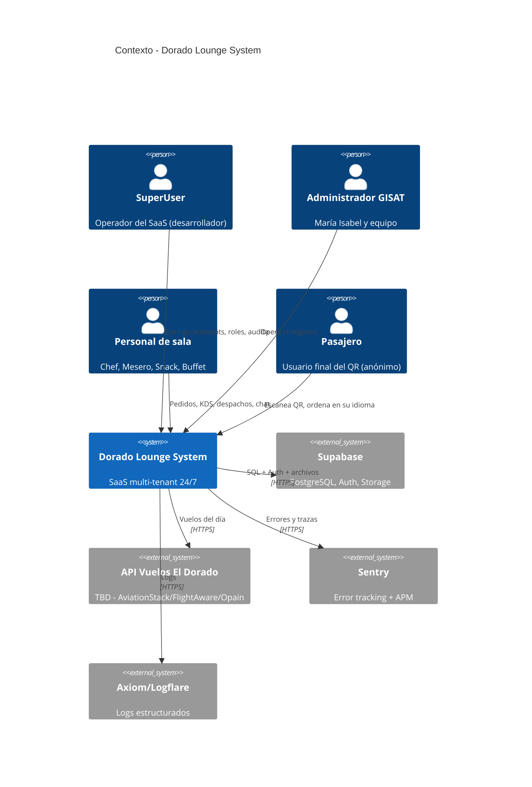
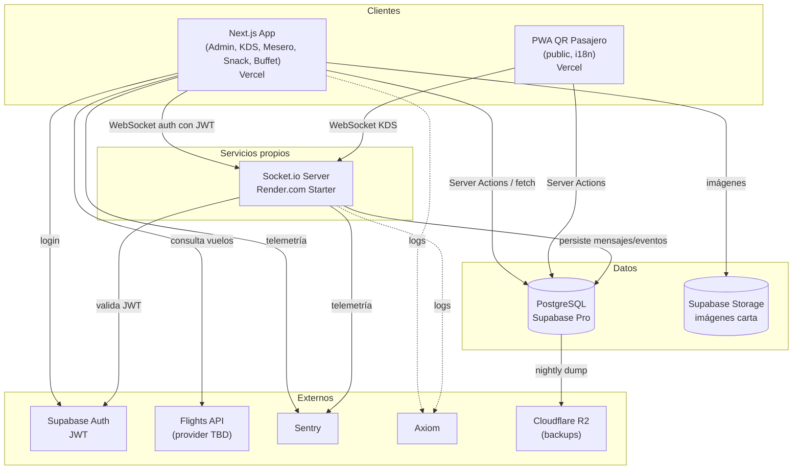
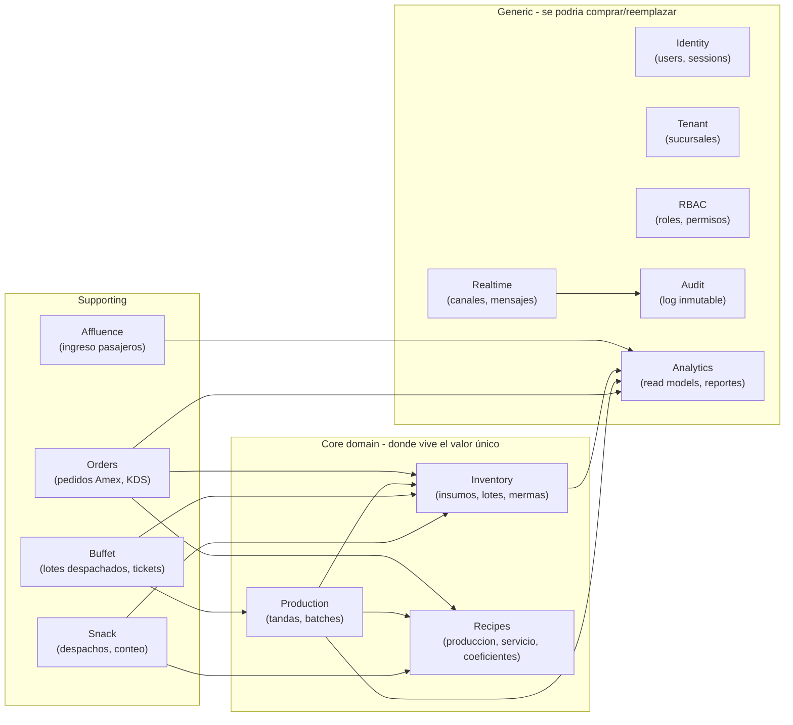
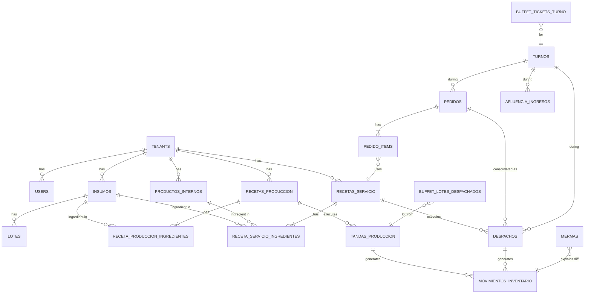
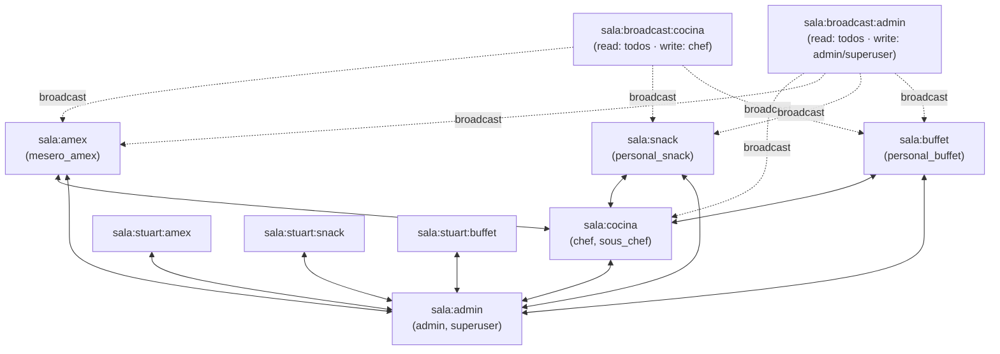

# ARCHITECTURE.md — Dorado Lounge System

> Documento maestro de arquitectura técnica. Vive junto a `CLAUDE.md` en la raíz del repo.
> **Jerarquía de autoridad:** `CLAUDE.md` (operacional) → `ARCHITECTURE.md` (este, técnico) → `docs/analisis-v6.docx` (especificación de negocio).
> Si hay contradicción real, **se discute, no se improvisa**.

**Versión:** 1.0 · **Fecha:** Mayo 2025 · **Stack:** ver `CLAUDE.md`
**Idioma:** prosa en español, identificadores y código en inglés (mismo patrón `jrxdevs-sistemas`).

---

## Índice

1. [Resumen ejecutivo](#1-resumen-ejecutivo)
2. [Hallazgos críticos sobre el documento de análisis](#2-hallazgos-críticos-sobre-el-documento-de-análisis)
3. [Decisiones de arquitectura (ADRs)](#3-decisiones-de-arquitectura-adrs)
4. [Visión del sistema (C4 — Contexto y Contenedores)](#4-visión-del-sistema-c4--contexto-y-contenedores)
5. [Bounded contexts y mapa de dominio](#5-bounded-contexts-y-mapa-de-dominio)
6. [Stack tecnológico — justificación capa por capa](#6-stack-tecnológico--justificación-capa-por-capa)
7. [Estructura del repositorio (monorepo modular)](#7-estructura-del-repositorio-monorepo-modular)
8. [Modelo de datos — esquema PostgreSQL](#8-modelo-de-datos--esquema-postgresql)
9. [Motor de inventario y merma — algoritmos críticos](#9-motor-de-inventario-y-merma--algoritmos-críticos)
10. [Real-time engine — topología y contratos](#10-real-time-engine--topología-y-contratos)
11. [Seguridad — autenticación, autorización, hardening](#11-seguridad--autenticación-autorización-hardening)
12. [Observabilidad — logs, métricas, trazas, alertas](#12-observabilidad--logs-métricas-trazas-alertas)
13. [Estrategia de pruebas](#13-estrategia-de-pruebas)
14. [Despliegue, entornos y disaster recovery](#14-despliegue-entornos-y-disaster-recovery)
15. [Rendimiento y escalabilidad](#15-rendimiento-y-escalabilidad)
16. [Calidad de código — Clean Architecture en la práctica](#16-calidad-de-código--clean-architecture-en-la-práctica)
17. [Plan de sprints — 6 meses, riesgo gestionado](#17-plan-de-sprints--6-meses-riesgo-gestionado)
18. [Registro de riesgos](#18-registro-de-riesgos)
19. [Preguntas abiertas para el cliente](#19-preguntas-abiertas-para-el-cliente)

---

## 1. Resumen ejecutivo

**Producto:** SaaS multi-tenant para operación 24/7 de salas VIP aeroportuarias. Núcleo: trazabilidad total de inventario gobernada por recetas con coeficiente de merma, comunicación en tiempo real con topología jerárquica, y motor de analytics que cruza producción, consumo y afluencia.

**Drivers arquitectónicos** (ordenados por peso):

1. **Integridad de datos absoluta.** Cada gramo descontado de bodega debe ser reconstruible. La trazabilidad no es un *nice-to-have*: es el producto.
2. **Disponibilidad 24/7 sin ventanas.** El aeropuerto no para; el sistema tampoco.
3. **Latencia perceptible <1 s** en KDS, chat y Stock Out. Una alerta lenta deja de ser alerta.
4. **Multi-tenant aislado por defecto.** Un bug nunca debe filtrar datos entre clientes.
5. **Operable por una sola persona.** El desarrollador es el equipo: la solución debe ser depurable, observable y reversible por un humano.
6. **Costo operativo bajo en arranque.** Cada cliente nuevo paga su propia infraestructura, no requiere reinversión.

**Forma de la solución:** **monolito modular** en Next.js 14 con un **servidor Socket.io independiente** como único colaborador remoto. Domain-Driven Design por bounded contexts dentro del monolito; eventos de dominio persistidos en Postgres como única fuente de verdad para auditoría y replay. Postgres con Row-Level Security para aislamiento multi-tenant. Lo que *no* se hace: microservicios, message brokers externos, Kubernetes, ni separación frontend/backend artificial.

---

## 2. Hallazgos críticos sobre el documento de análisis

Esta sección lista lo que un arquitecto principal cuestionaría en una revisión formal del `analisis-v6.docx`. No son cambios al stack ni a las decisiones cerradas en `CLAUDE.md`; son **brechas que deben cerrarse antes o durante el Sprint 1** para evitar deuda técnica fundacional.

### 2.1 Aislamiento multi-tenant insuficientemente especificado
El documento dice "datos aislados por `tenant_id`" pero no menciona Row-Level Security. Filtrar por `tenant_id` en queries de la aplicación es la #1 causa documentada de filtraciones cross-tenant en SaaS. **Decisión:** RLS de Postgres es obligatorio. El JWT lleva `tenant_id` y `role`; las políticas RLS los leen vía `auth.jwt()`. La aplicación nunca confía en sí misma para filtrar tenants. Detalle en §11.4.

### 2.2 Ausencia total de observabilidad en el spec
"99.5% de disponibilidad" sin un párrafo sobre cómo se mide, alerta o recupera. Para un sistema 24/7 esto es un agujero. **Decisión:** observabilidad de primer día — Sentry para errores, Logflare/Axiom para logs estructurados, Better Stack o UptimeRobot para *uptime*, Vercel Analytics + Web Vitals para frontend. Detalle en §12.

### 2.3 El cálculo de "costo por usuario" está mal definido
La fórmula `gasto_insumos / pasajeros_ingresados` mezcla dos cosas distintas: **gasto** (dinero que salió a proveedores) y **costo de ventas** (insumos efectivamente consumidos). Estos son distintos porque (a) las compras se hacen por lotes que duran varios turnos, (b) las mermas categorizadas no deben atribuirse al pasajero, y (c) el inventario terminal del turno es propiedad del siguiente.

**Decisión:** dos métricas separadas, ambas reportadas:
- `cogs_per_passenger` = (consumo aplicado por recetas + merma operativa) / pasajeros
- `cash_outflow_per_passenger` = compras del período / pasajeros
La primera es la **eficiencia operativa real**; la segunda es flujo de caja. Confundirlas es por qué los restaurantes quiebran. Detalle en §9.6.

### 2.4 Concurrencia en KDS y descuento de inventario sin tratar
Tres meseros confirmando entrega de pedidos al mismo segundo, dos chefs aceptando el mismo ticket KDS, un Stock Out emitido dos veces por mash de botón. El documento no menciona estas condiciones. En producción, **explotan**. **Decisión:** transacciones serializables para descuentos de inventario, locks `FOR UPDATE` en `lotes`, máquinas de estado explícitas para pedidos con transiciones validadas, idempotency keys en Stock Out (ver §9.4 y §10.5).

### 2.5 FIFO/FEFO mencionado pero no modelado
"FIFO inteligente" aparece dos veces en el doc pero no hay tabla `lotes`. Sin lotes, no hay FIFO real, solo deseo de FIFO. **Decisión:** tabla `lotes` con `fecha_recibido`, `fecha_vencimiento`, `cantidad_actual`, `tenant_id`, `insumo_id`. Política de descuento: **FEFO** (First-Expired-First-Out) por defecto, con fallback a FIFO si las fechas son iguales. Esto previene vencimientos automáticamente. Detalle en §9.2.

### 2.6 Auditoría descrita pero no garantizada como inmutable
"Registro inmutable" es prometido en RF-15 pero `DELETE` y `UPDATE` en Postgres son operaciones triviales si tienes `service_role`. **Decisión:** tabla `audit_log` append-only enforced por trigger (`BEFORE UPDATE/DELETE → RAISE EXCEPTION`), encadenada con hash de la fila anterior (tamper-evident). Sin esto, "inmutable" es marketing, no realidad técnica. Detalle en §11.7.

### 2.7 PWA QR sin estrategia anti-abuso
"Sin login" + "PWA pública" = vector de spam, scraping de carta y ataques de inventario falso. **Decisión:** sesión anónima con token firmado por mesa al escanear el QR (válido para esa mesa por X horas), rate limiting por token, captcha invisible (Cloudflare Turnstile) en el primer pedido, prevención de doble submit por idempotency key. Detalle en §11.5.

### 2.8 Resiliencia offline no contemplada
Cocinas y barras pierden WiFi. Si un mesero pierde conexión a mitad de un pedido, ¿qué pasa? El doc no lo dice. **Decisión:** PWA con service worker, cola offline en IndexedDB con reintentos, optimistic UI en operaciones idempotentes, bloqueo de operaciones críticas (despacho, cierre de buffet) hasta reconexión. Detalle en §15.3.

### 2.9 Backup y disaster recovery ausentes
"Disponibilidad 99.5%" sin DR es aspiracional. **Decisión:** Supabase Pro obligatorio en producción ($25 USD/mes — el doc lo asume, no lo problematiza) por PITR (Point-In-Time Recovery) de 7 días + dump diario a almacenamiento off-vendor (Cloudflare R2 o S3) cifrado en reposo. RTO objetivo: 4 h. RPO objetivo: 5 min. Detalle en §14.5.

### 2.10 Render free para Socket.io es incompatible con 24/7
El doc dice "Render.com gratis" para Socket.io, pero el plan free de Render hiberna tras inactividad. Una sala VIP aeroportuaria 24/7 hiberna y un mesero pierde el chat. **Decisión:** Render Starter ($7/mes) o Fly.io en el plan más bajo. Costo asumido en producción, no negociable. El stack libre solo aplica a desarrollo.

### 2.11 Integración con API de vuelos sin proveedor definido
`FLIGHTS_API_KEY` aparece pero no hay vendor seleccionado. El Dorado opera sobre SITA y Opain tiene sus propias API. **Decisión:** documentar como "TBD — Sprint 6" con candidatos: AviationStack (más barato, datos genéricos), FlightAware AeroAPI (estándar de la industria, costoso), Opain directo (requiere convenio). Mientras tanto, abstraer detrás de un puerto `FlightsProvider` (hexagonal) para no acoplar el código.

### 2.12 Habeas data (Ley 1581) no abordada
Pasajeros internacionales escaneando QR generan datos personales (idioma, dispositivo, hora, mesa). El cliente es responsable bajo Ley 1581. **Decisión:** política de retención explícita (90 días para datos de pedidos QR sin login), endpoint de derecho al olvido, tratamiento documentado, cookies banner en el QR PWA. Detalle en §11.8.

### 2.13 SLA de tiempos sin metodología clara
"<1 s para chat y KDS" es un objetivo, no una métrica. **Decisión:** definir como p95 medido en cliente con Web Vitals + Sentry Performance: `kds_event_to_render_p95 < 1500ms`, `chat_send_to_ack_p95 < 500ms`, `stock_out_to_admin_visible_p95 < 1000ms`. Sin medir, no es real.

### 2.14 RBAC configurable desde SuperUser — bonito, peligroso
"El SuperUser configura qué elementos de la interfaz son visibles para cada rol" suena a power-user feature. En la práctica genera (a) caching nightmares, (b) testing combinatorio explosivo, (c) bugs de seguridad por configuraciones inválidas. **Decisión refinada:** roles fijos en código (los 7 listados en `CLAUDE.md`); el SuperUser configura **permisos opcionales** dentro de un rol (matriz finita), no la estructura de la UI. La UI por rol es una *constante de diseño*, no una variable de runtime. Esto preserva la promesa al cliente sin abrir una caja de Pandora.

### 2.15 "Difusión global solo desde cocina" como única regla de broadcast
Falta el caso del SuperUser/Admin: necesitan poder emitir avisos del sistema (mantenimiento, cambios de turno). **Decisión:** dos canales de broadcast — `sala:broadcast:cocina` (chef) y `sala:broadcast:admin` (admin/superuser). Detalle en §10.

---

## 3. Decisiones de arquitectura (ADRs)

Formato corto. Una ADR completa por cada una vivirá en `docs/adr/NNN-titulo.md` cuando lo amerite.

| # | Decisión | Estado | Razón |
|---|---|---|---|
| 001 | Monolito modular en Next.js 14 + servidor Socket.io independiente | Aceptada | Equipo unipersonal, 6 meses, dominio coherente. Microservicios sería sobreingeniería. |
| 002 | DDD con bounded contexts dentro del monolito | Aceptada | El dominio (inventario/recetas/merma) es complejo y central; aislarlo como dominio puro paga compounding interest. |
| 003 | Hexagonal en cada bounded context (puertos/adaptadores) | Aceptada | Permite reemplazar Supabase, Socket.io o el proveedor de vuelos sin reescribir la lógica de negocio. |
| 004 | Postgres como única fuente de verdad + RLS para multi-tenancy | Aceptada | Aislamiento a nivel DB es defensa en profundidad real, no aspiracional. |
| 005 | Server Actions de Next.js para mutaciones, queries directas para lecturas | Aceptada | Coherente con `jrxdevs-sistemas`; reduce la superficie de API. |
| 006 | Eventos de dominio persistidos (`domain_events` table) | Aceptada | Auditoría real + replay para debugging + futura proyección a read models sin acoplar código. |
| 007 | CQRS *light*: vistas materializadas para analytics, mismo Postgres | Aceptada | OLTP y OLAP separados lógicamente sin agregar infra. Refresh programado. Pasamos a read replica si crece. |
| 008 | Socket.io con autenticación JWT en handshake + middleware de canales | Aceptada (heredada de `CLAUDE.md`) | Granularidad de permisos requerida por la topología. |
| 009 | Coeficiente de merma aplicado en una sola función pura, testeada exhaustivamente | Aceptada | Es el corazón del producto. Si esto está mal, el producto está mal. |
| 010 | Lotes con política FEFO (First-Expired-First-Out) | Aceptada (corrección al spec) | "FIFO inteligente" mal definido en el documento original. FEFO previene vencimientos. |
| 011 | Audit log append-only via trigger + hash chain | Aceptada (corrección al spec) | "Inmutable" en RF-15 requiere enforcement técnico, no solo política. |
| 012 | Idempotency keys en operaciones críticas (Stock Out, despacho, ticket) | Aceptada (corrección al spec) | Doble submit por mash de botón o reintento offline rompe inventario. |
| 013 | Sentry + Axiom + Better Stack desde el día 1 | Aceptada (corrección al spec) | Sin observabilidad, los SLA del documento son ficción. |
| 014 | Roles fijos en código; permisos finitos configurables por SuperUser | Aceptada (refinamiento al spec) | Configurar UI por rol en runtime es una trampa. Roles son constantes, permisos son variables. |
| 015 | RPC de Postgres (funciones SQL) para operaciones atómicas críticas | Aceptada | Descuento de inventario debe ocurrir en una transacción serializable; intentar coordinarlo desde Node es frágil. |
| 016 | TypeScript estricto + Zod en bordes (UI ↔ server, server ↔ socket) | Aceptada | Misma defensa que `jrxdevs`. Tipo runtime + tipo de compilación, sin huecos. |
| 017 | Monorepo con pnpm workspaces (web + socket-server + shared types) | Aceptada | Tipos compartidos sin versioning friction; deploy independiente. |
| 018 | i18n del QR como rutas dinámicas de Next (`/qr/[locale]`) | Aceptada | Bundle splitting natural; SEO no aplica (es PWA privada por mesa) pero el patrón es estándar. |

---

## 4. Visión del sistema (C4 — Contexto y Contenedores)

### 4.1 Diagrama de contexto (C1)



### 4.2 Diagrama de contenedores (C2)



**Por qué este corte:** un solo servicio Node propio (Socket.io). Todo lo demás es Vercel + Supabase + servicios SaaS. Operativamente es un sistema de un dev. La complejidad está en el dominio, no en la infra.

---

## 5. Bounded contexts y mapa de dominio

DDD táctico aplicado al dominio. Cada *bounded context* tiene su propio lenguaje ubicuo, sus entidades, sus invariantes, y se materializa como un módulo en `src/modules/`.



**Reglas de relación:**
- Los módulos `core` no dependen de los `support`. Los `support` orquestan `core`.
- Ningún módulo importa directamente de otro: comunican vía **eventos de dominio** o **APIs explícitas** (`actions.ts` exportado).
- `Analytics` es solo-lectura: nunca produce eventos, solo proyecta.
- `Audit` es transversal: cualquier módulo emite eventos de auditoría, pero ninguno depende de su lectura.

**Lenguaje ubicuo (extracto, en español por insistencia del documento):**
- *Insumo*: ítem de Capa 1 (materia prima).
- *Producto interno*: ítem de Capa 2 (elaborado en cocina).
- *Receta de producción*: regla de transformación Capa 1 → Capa 2.
- *Receta de servicio*: regla de descuento al despachar a una zona.
- *Tanda*: ejecución concreta de una receta de producción (un batch).
- *Despacho*: ejecución concreta de una receta de servicio.
- *Lote*: cantidad recibida de un insumo en una compra (con su vencimiento).
- *Coeficiente de merma*: porcentaje de pérdida esperada en una receta.
- *Merma categorizada*: pérdida con causa registrada (5 tipos).
- *Conciliación de buffet*: igualar tickets recolectados contra porciones despachadas.

---

## 6. Stack tecnológico — justificación capa por capa

| Capa | Tecnología | Por qué esta y no otra |
|---|---|---|
| Framework web | **Next.js 14 (App Router)** | Server Actions reducen API surface; SSR para dashboards admin; es el stack del dev. Alternativas (Remix, SvelteKit) ofrecen ventajas marginales que no compensan retrabajo. |
| Lenguaje | **TypeScript estricto** (`strict: true`) | Tipos en compilación. No negociable para un sistema con esta cantidad de invariantes. |
| UI | **React + Tailwind + shadcn/ui** | Tailwind y shadcn dan diseño consistente sin fricción. Modo oscuro es un toggle. |
| Validación | **Zod + React Hook Form** | Una sola fuente de verdad para tipos runtime + compile-time. Mismo patrón que `jrxdevs`. |
| Auth | **Supabase Auth (JWT)** | Integrado con RLS. JWT lleva `tenant_id` y `role` en custom claims. |
| DB | **PostgreSQL 15+ (Supabase)** | Transacciones serializables, RLS, triggers, constraint checks, vistas materializadas, LISTEN/NOTIFY. Todo lo necesario. |
| Real-time | **Socket.io en Node.js** | Granularidad de canales y permisos por rol. Supabase Realtime es excelente para state replication, mediocre para chat con permisos. Decisión heredada de `CLAUDE.md`. |
| i18n | **next-intl** | Routing por locale, message catalogs, integración con App Router. Probado. |
| Testing | **Vitest + Playwright + Testing Library** | Vitest es 5–10x más rápido que Jest en este stack y comparte plugin de TS con Vite. Playwright para E2E real-time (puede manejar WebSockets). |
| Linting | **ESLint + Prettier + TS-ESLint estricto** | Sin debate. |
| Hooks | **Husky + lint-staged + commitlint** | Conventional Commits desde el primer commit. |
| Observabilidad | **Sentry + Axiom + Better Stack** | Errores + APM (Sentry), logs estructurados (Axiom barato y rápido), uptime + status page (Better Stack). |
| Deploy web | **Vercel Pro** | Edge network, deploy preview por PR, secretos cifrados, integra con GitHub. |
| Deploy socket | **Render.com Starter** ($7) o **Fly.io** | Necesita conexión persistente y healthcheck WS. |
| Storage backups | **Cloudflare R2** | S3-compatible, sin egress cost, $0.015/GB. Off-vendor de Supabase = independencia. |
| CI/CD | **GitHub Actions** | Built-in, suficiente para este alcance. |
| IaC | **No por ahora** | Terraform es prematura optimización para 1 servicio Node + Vercel + Supabase. Los proveedores tienen UI estable. Se introduce cuando haya >5 entornos o >2 regiones. |

**Lo que explícitamente *no* usamos y por qué:**
- **AWS / Kubernetes / Docker en producción**: complejidad operativa injustificada para el tamaño actual. Vercel y Render hacen el trabajo sin equipo de DevOps.
- **NestJS / FastAPI**: separar API server de Next.js obliga a un BFF y duplica auth. No hay ganancia.
- **Redis**: no se necesita aún. Si aparece necesidad de cache compartido, Upstash Redis serverless. Mientras tanto, cache local en Next + Postgres es suficiente.
- **Message broker (RabbitMQ, Kafka)**: postgres LISTEN/NOTIFY más `domain_events` table cubren todo el patrón pub/sub que necesitamos. Brokers son para cuando los eventos cruzan servicios.
- **Microservicios**: ver ADR 001.
- **GraphQL**: Server Actions y queries Supabase tipadas resuelven el caso. GraphQL sería overhead.

---

## 7. Estructura del repositorio (monorepo modular)

```
dorado-lounge-system/
├── apps/
│   ├── web/                          # Next.js 14
│   │   ├── src/
│   │   │   ├── app/
│   │   │   │   ├── (auth)/           # login, signup
│   │   │   │   ├── (superuser)/      # god mode
│   │   │   │   ├── (admin)/          # operación
│   │   │   │   ├── (cocina)/         # KDS, producción
│   │   │   │   ├── (amex)/           # mesero
│   │   │   │   ├── (snack)/
│   │   │   │   ├── (buffet)/
│   │   │   │   ├── qr/[locale]/      # PWA pública
│   │   │   │   └── api/
│   │   │   │       └── webhooks/     # callbacks externos
│   │   │   ├── components/           # ui, kds, chat, inventory…
│   │   │   ├── lib/
│   │   │   │   ├── supabase/         # client.ts, server.ts, admin.ts
│   │   │   │   ├── socket/           # cliente
│   │   │   │   ├── auth/             # guards, RBAC matrix
│   │   │   │   └── observability/    # sentry init, logger
│   │   │   └── modules/              # bounded contexts (ver §5)
│   │   │       ├── inventory/
│   │   │       │   ├── domain/       # entidades, value objects, eventos
│   │   │       │   ├── application/  # casos de uso
│   │   │       │   ├── infrastructure/ # supabase repo, mappers
│   │   │       │   ├── actions.ts    # server actions exportadas
│   │   │       │   └── tests/
│   │   │       ├── recipes/
│   │   │       ├── production/
│   │   │       ├── orders/
│   │   │       ├── buffet/
│   │   │       ├── snack/
│   │   │       ├── affluence/
│   │   │       ├── identity/
│   │   │       ├── tenants/
│   │   │       ├── rbac/
│   │   │       ├── realtime/
│   │   │       ├── audit/
│   │   │       └── analytics/
│   │   ├── public/
│   │   ├── messages/                 # next-intl: es.json, en.json, fr.json, pt.json
│   │   ├── playwright/
│   │   ├── package.json
│   │   ├── next.config.mjs
│   │   ├── tailwind.config.ts
│   │   └── tsconfig.json
│   └── socket-server/                # Servidor Socket.io
│       ├── src/
│       │   ├── index.ts
│       │   ├── auth/                 # JWT verify + tenant resolution
│       │   ├── channels/             # registro de canales y permisos
│       │   ├── handlers/             # un handler por canal
│       │   ├── persistence/          # repo de mensajes a Supabase
│       │   └── observability/
│       ├── package.json
│       └── tsconfig.json
├── packages/
│   ├── shared-types/                 # Tipos compartidos web ↔ socket
│   │   ├── src/
│   │   │   ├── domain-events.ts
│   │   │   ├── socket-events.ts      # contrato de canales
│   │   │   └── enums.ts              # roles, categorias merma…
│   │   └── package.json
│   ├── shared-validation/            # Schemas Zod reutilizables
│   └── eslint-config/
├── supabase/
│   ├── migrations/                   # SQL idempotente
│   ├── seed/                         # datos para dev
│   └── tests/                        # pgtap o sql tests
├── docs/
│   ├── adr/                          # ADR completas
│   ├── api/                          # contratos
│   ├── runbooks/                     # qué hacer cuando X falla
│   └── analisis-v6.docx
├── .github/workflows/
│   ├── ci.yml                        # lint + test + build
│   ├── e2e.yml
│   └── deploy.yml
├── pnpm-workspace.yaml
├── package.json
├── CLAUDE.md
├── ARCHITECTURE.md                   # este archivo
└── README.md
```

**Notas:**
- Cada `module/` sigue Hexagonal: `domain/` no importa nada externo; `infrastructure/` adapta a Supabase; `application/` orquesta.
- `actions.ts` es la **única superficie pública** del módulo. Si algo no está exportado allí, no se puede usar fuera del módulo. Refuerzo con ESLint `no-restricted-imports`.
- `shared-types` se comparte entre web y socket-server: garantiza que un evento emitido por uno sea entendido por el otro en compile-time.

---

## 8. Modelo de datos — esquema PostgreSQL

Esta sección presenta el diseño nuclear. **No es exhaustivo**: las tablas se completan en migraciones del Sprint 1–2. Lo aquí mostrado es el contrato de invariantes.

### 8.1 Convenciones globales

- **Todos los IDs son `uuid` con `gen_random_uuid()`**. Predecibilidad cero.
- **Todas las tablas tienen `tenant_id uuid NOT NULL`** (excepto `tenants` y tablas de plataforma).
- **Todas las tablas tienen `created_at`, `updated_at`, `created_by`, `updated_by`**.
- **Soft delete** en lugar de DELETE (`deleted_at` nullable) excepto en `audit_log` y `domain_events` (immutable real).
- **Monetario**: `numeric(14,2)` en COP. Nunca `float`.
- **Cantidades de inventario**: `numeric(12,4)` para soportar 4 decimales (gramos, ml).
- **Timestamps**: `timestamptz`, siempre. UTC en DB, conversión en UI.

### 8.2 ER de dominio (núcleo)



### 8.3 Tablas críticas — DDL ilustrativo

> **Nota**: solo se muestran las tablas con invariantes complejas o no obvias. Las restantes (`users`, `tenants`, `proveedores`, etc.) son CRUD estándar.

```sql
-- Insumos: Capa 1
CREATE TABLE insumos (
  id            uuid PRIMARY KEY DEFAULT gen_random_uuid(),
  tenant_id     uuid NOT NULL REFERENCES tenants(id),
  codigo        text NOT NULL,
  nombre        text NOT NULL,
  unidad_base   text NOT NULL CHECK (unidad_base IN ('g','ml','unidad')),
  categoria     text,
  stock_minimo  numeric(12,4) NOT NULL DEFAULT 0,
  activo        boolean NOT NULL DEFAULT true,
  created_at    timestamptz NOT NULL DEFAULT now(),
  updated_at    timestamptz NOT NULL DEFAULT now(),
  deleted_at    timestamptz,
  UNIQUE (tenant_id, codigo)
);

-- Lotes: trazabilidad FEFO
CREATE TABLE lotes (
  id              uuid PRIMARY KEY DEFAULT gen_random_uuid(),
  tenant_id       uuid NOT NULL REFERENCES tenants(id),
  insumo_id       uuid NOT NULL REFERENCES insumos(id),
  proveedor_id    uuid REFERENCES proveedores(id),
  fecha_recibido  date NOT NULL,
  fecha_vencimiento date NOT NULL,
  cantidad_inicial  numeric(12,4) NOT NULL CHECK (cantidad_inicial > 0),
  cantidad_actual   numeric(12,4) NOT NULL CHECK (cantidad_actual >= 0),
  costo_unitario    numeric(14,4) NOT NULL CHECK (costo_unitario >= 0),
  unidad            text NOT NULL,                     -- unidad de compra (kg, lt, etc.)
  factor_a_base     numeric(12,4) NOT NULL,            -- 1000 si compra es kg y unidad_base es g
  notas             text,
  created_at        timestamptz NOT NULL DEFAULT now(),
  CONSTRAINT lote_cantidad_no_excede_inicial CHECK (cantidad_actual <= cantidad_inicial)
);
CREATE INDEX idx_lotes_fefo ON lotes(tenant_id, insumo_id, fecha_vencimiento)
  WHERE cantidad_actual > 0;

-- Recetas: producción y servicio (single-table inheritance vía tipo)
CREATE TYPE tipo_receta AS ENUM ('produccion','servicio');

CREATE TABLE recetas (
  id              uuid PRIMARY KEY DEFAULT gen_random_uuid(),
  tenant_id       uuid NOT NULL REFERENCES tenants(id),
  tipo            tipo_receta NOT NULL,
  codigo          text NOT NULL,
  nombre          text NOT NULL,
  rendimiento     numeric(12,4) NOT NULL,              -- "produce 20 porciones"
  unidad_rendimiento text NOT NULL,
  merma_coeficiente numeric(5,4) NOT NULL DEFAULT 0    -- 0.0000 a 0.9999
                    CHECK (merma_coeficiente >= 0 AND merma_coeficiente < 1),
  producto_resultante_id uuid                           -- solo si tipo='produccion'
                          REFERENCES productos_internos(id),
  activa          boolean NOT NULL DEFAULT true,
  version         int NOT NULL DEFAULT 1,              -- recetas son versionadas
  reemplaza_a     uuid REFERENCES recetas(id),         -- linaje
  created_at      timestamptz NOT NULL DEFAULT now(),
  UNIQUE (tenant_id, codigo, version),
  CHECK (
    (tipo = 'produccion' AND producto_resultante_id IS NOT NULL)
    OR
    (tipo = 'servicio' AND producto_resultante_id IS NULL)
  )
);

-- Movimientos de inventario: la verdad atómica
CREATE TYPE tipo_movimiento AS ENUM (
  'entrada_compra',         -- llega de proveedor (suma a lote)
  'salida_produccion',      -- consumo por tanda (resta de lote)
  'entrada_produccion',     -- producto interno generado por tanda (suma a producto_interno)
  'salida_despacho',        -- consumo por despacho a zona
  'salida_merma',           -- categorizada
  'ajuste_inventario'       -- conteo físico, requiere aprobación
);

CREATE TABLE movimientos_inventario (
  id              uuid PRIMARY KEY DEFAULT gen_random_uuid(),
  tenant_id       uuid NOT NULL REFERENCES tenants(id),
  tipo            tipo_movimiento NOT NULL,
  insumo_id       uuid REFERENCES insumos(id),
  producto_interno_id uuid REFERENCES productos_internos(id),
  lote_id         uuid REFERENCES lotes(id),
  cantidad        numeric(12,4) NOT NULL,
  unidad          text NOT NULL,
  cantidad_base   numeric(12,4) NOT NULL,              -- normalizada a unidad_base
  costo_total     numeric(14,4),
  origen_tipo     text,                                 -- 'tanda','despacho','pedido','merma'
  origen_id       uuid,                                 -- FK polimórfica
  turno_id        uuid REFERENCES turnos(id),
  user_id         uuid REFERENCES users(id),
  idempotency_key text,                                 -- previene doble registro
  created_at      timestamptz NOT NULL DEFAULT now(),
  CONSTRAINT mov_insumo_o_producto CHECK (
    (insumo_id IS NOT NULL) <> (producto_interno_id IS NOT NULL)
  ),
  UNIQUE (tenant_id, idempotency_key) WHERE idempotency_key IS NOT NULL
);
CREATE INDEX idx_mov_turno ON movimientos_inventario(tenant_id, turno_id);
CREATE INDEX idx_mov_origen ON movimientos_inventario(origen_tipo, origen_id);

-- Mermas categorizadas
CREATE TYPE categoria_merma AS ENUM (
  'retraso_entrega','robo_faltante','vencimiento','desperdicio_proceso','descarte_accidental'
);

CREATE TABLE mermas (
  id              uuid PRIMARY KEY DEFAULT gen_random_uuid(),
  tenant_id       uuid NOT NULL REFERENCES tenants(id),
  movimiento_id   uuid NOT NULL REFERENCES movimientos_inventario(id),
  categoria       categoria_merma NOT NULL,
  descripcion     text,
  aprobado_por    uuid REFERENCES users(id),            -- requerido si categoria = 'robo_faltante'
  aprobado_at     timestamptz,
  created_at      timestamptz NOT NULL DEFAULT now(),
  CHECK (
    categoria <> 'robo_faltante'
    OR (aprobado_por IS NOT NULL AND aprobado_at IS NOT NULL)
  )
);

-- Pedidos: máquina de estados
CREATE TYPE estado_pedido AS ENUM (
  'creado','en_preparacion','despachado','entregado','cancelado'
);

CREATE TABLE pedidos (
  id            uuid PRIMARY KEY DEFAULT gen_random_uuid(),
  tenant_id     uuid NOT NULL REFERENCES tenants(id),
  origen        text NOT NULL CHECK (origen IN ('mesero','qr_pasajero')),
  mesa          text NOT NULL,
  mesero_id     uuid REFERENCES users(id),
  qr_session_id uuid,                                   -- si origen='qr_pasajero'
  locale        text,                                   -- es/en/fr/pt
  estado        estado_pedido NOT NULL DEFAULT 'creado',
  turno_id      uuid REFERENCES turnos(id),
  sla_hasta     timestamptz,
  observaciones text,
  version       int NOT NULL DEFAULT 1,                 -- optimistic locking
  created_at    timestamptz NOT NULL DEFAULT now(),
  preparado_at  timestamptz,
  despachado_at timestamptz,
  entregado_at  timestamptz
);

-- Tickets de buffet: agregado por turno (no por evento)
CREATE TABLE buffet_tickets_turno (
  id              uuid PRIMARY KEY DEFAULT gen_random_uuid(),
  tenant_id       uuid NOT NULL REFERENCES tenants(id),
  turno_id        uuid NOT NULL REFERENCES turnos(id),
  total_tickets   int NOT NULL CHECK (total_tickets >= 0),
  registrado_por  uuid NOT NULL REFERENCES users(id),
  registrado_at   timestamptz NOT NULL DEFAULT now(),
  observaciones   text,
  UNIQUE (tenant_id, turno_id)                          -- un solo cierre por turno
);

-- Eventos de dominio: append-only
CREATE TABLE domain_events (
  id              uuid PRIMARY KEY DEFAULT gen_random_uuid(),
  tenant_id       uuid NOT NULL,
  aggregate_type  text NOT NULL,
  aggregate_id    uuid NOT NULL,
  event_type      text NOT NULL,                        -- e.g. 'OrderDispatched'
  payload         jsonb NOT NULL,
  user_id         uuid,
  occurred_at     timestamptz NOT NULL DEFAULT now(),
  schema_version  int NOT NULL DEFAULT 1
);
CREATE INDEX idx_events_aggregate ON domain_events(aggregate_type, aggregate_id);
CREATE INDEX idx_events_tenant_time ON domain_events(tenant_id, occurred_at DESC);

-- Trigger que bloquea UPDATE/DELETE en domain_events
CREATE OR REPLACE FUNCTION block_event_mutation() RETURNS trigger
LANGUAGE plpgsql AS $$
BEGIN
  RAISE EXCEPTION 'domain_events is append-only';
END $$;
CREATE TRIGGER no_update_events BEFORE UPDATE ON domain_events
  FOR EACH ROW EXECUTE FUNCTION block_event_mutation();
CREATE TRIGGER no_delete_events BEFORE DELETE ON domain_events
  FOR EACH ROW EXECUTE FUNCTION block_event_mutation();

-- Audit log con hash chain
CREATE TABLE audit_log (
  id              bigserial PRIMARY KEY,
  tenant_id       uuid NOT NULL,
  actor_id        uuid,
  action          text NOT NULL,
  resource_type   text,
  resource_id     uuid,
  ip              inet,
  user_agent      text,
  payload         jsonb,
  prev_hash       bytea,                                -- hash de la fila anterior
  row_hash        bytea NOT NULL,                       -- hash de esta fila
  occurred_at     timestamptz NOT NULL DEFAULT now()
);

CREATE OR REPLACE FUNCTION audit_chain_insert() RETURNS trigger
LANGUAGE plpgsql AS $$
DECLARE
  prev bytea;
BEGIN
  SELECT row_hash INTO prev
  FROM audit_log
  WHERE tenant_id = NEW.tenant_id
  ORDER BY id DESC
  LIMIT 1;

  NEW.prev_hash := prev;
  NEW.row_hash := digest(
    coalesce(prev,'\x00') || NEW.tenant_id::text ||
    coalesce(NEW.actor_id::text,'') || NEW.action ||
    coalesce(NEW.payload::text,'') || NEW.occurred_at::text,
    'sha256'
  );
  RETURN NEW;
END $$;
CREATE TRIGGER tr_audit_chain BEFORE INSERT ON audit_log
  FOR EACH ROW EXECUTE FUNCTION audit_chain_insert();
CREATE TRIGGER no_update_audit BEFORE UPDATE ON audit_log
  FOR EACH ROW EXECUTE FUNCTION block_event_mutation();
CREATE TRIGGER no_delete_audit BEFORE DELETE ON audit_log
  FOR EACH ROW EXECUTE FUNCTION block_event_mutation();
```

### 8.4 Particionamiento

Para tablas de alto volumen — `domain_events`, `audit_log`, `movimientos_inventario`, `mensajes_chat` — particionar por **`tenant_id`** (HASH 8 partitions) y subparticionar `domain_events` y `audit_log` por **mes**. Esto se introduce cuando la tabla principal supere ~5M filas, no antes.

### 8.5 Vistas materializadas para analytics

```sql
-- Métrica clave: producto gastado vs platos elaborados por turno
CREATE MATERIALIZED VIEW mv_consumo_vs_produccion_turno AS
SELECT
  m.tenant_id,
  m.turno_id,
  m.insumo_id,
  SUM(CASE WHEN m.tipo IN ('salida_produccion','salida_despacho')
           THEN m.cantidad_base ELSE 0 END) AS consumido_base,
  SUM(CASE WHEN m.tipo = 'salida_merma'
           THEN m.cantidad_base ELSE 0 END) AS mermado_base,
  SUM(m.costo_total) AS costo_total
FROM movimientos_inventario m
GROUP BY m.tenant_id, m.turno_id, m.insumo_id;

CREATE UNIQUE INDEX ON mv_consumo_vs_produccion_turno (tenant_id, turno_id, insumo_id);

-- Refresh: cron job cada 5 min en horas pico, cada hora fuera de pico
-- (alternativa: pg_cron con CONCURRENTLY)
```

---

## 9. Motor de inventario y merma — algoritmos críticos

Esta es la sección que justifica todo el sistema. Si algo aquí está mal, el producto no funciona.

### 9.1 Función pura del coeficiente de merma

```typescript
// modules/inventory/domain/merma.ts
import { z } from 'zod';

export const Cantidad = z.number().nonnegative();
export const Coeficiente = z.number().min(0).max(0.9999);

/**
 * Aplica el coeficiente de merma a una cantidad requerida.
 * Si una receta requiere 150g de pollo limpio y la merma es 0.25,
 * el sistema debe descontar 200g de pollo crudo del lote.
 *
 * cantidad_a_descontar = cantidad_requerida / (1 - coeficiente)
 */
export function cantidadConMerma(
  cantidadRequerida: number,
  coeficiente: number,
): number {
  Cantidad.parse(cantidadRequerida);
  Coeficiente.parse(coeficiente);
  // Redondear a 4 decimales para evitar drift de punto flotante
  return Math.round((cantidadRequerida / (1 - coeficiente)) * 10000) / 10000;
}
```

Esta función **no tiene dependencias**. Vive en `domain/`. Tiene tests exhaustivos: límites (0, 0.99), errores (>=1, <0), precisión, idempotencia. Si falla un solo test, el deploy se bloquea.

### 9.2 Política FEFO — descuento desde lotes

```sql
-- RPC atómica: descuenta una cantidad de un insumo siguiendo FEFO
-- Lockea las filas en orden para prevenir deadlocks
CREATE OR REPLACE FUNCTION fn_descontar_insumo_fefo(
  p_tenant_id      uuid,
  p_insumo_id      uuid,
  p_cantidad_base  numeric(12,4),
  p_origen_tipo    text,
  p_origen_id      uuid,
  p_turno_id       uuid,
  p_user_id        uuid,
  p_idempotency_key text
) RETURNS jsonb
LANGUAGE plpgsql
AS $$
DECLARE
  v_restante      numeric(12,4) := p_cantidad_base;
  v_lote          record;
  v_consumido     numeric(12,4);
  v_consumos      jsonb := '[]'::jsonb;
  v_costo_total   numeric(14,4) := 0;
BEGIN
  -- Idempotencia: si la key ya existe, retornar resultado previo
  IF EXISTS (
    SELECT 1 FROM movimientos_inventario
    WHERE tenant_id = p_tenant_id
      AND idempotency_key = p_idempotency_key
  ) THEN
    RETURN jsonb_build_object('ok', true, 'idempotent_replay', true);
  END IF;

  -- Recorre lotes vivos del insumo en orden FEFO con lock
  FOR v_lote IN
    SELECT id, cantidad_actual, costo_unitario, factor_a_base, fecha_vencimiento
    FROM lotes
    WHERE tenant_id = p_tenant_id
      AND insumo_id = p_insumo_id
      AND cantidad_actual > 0
      AND fecha_vencimiento >= current_date
    ORDER BY fecha_vencimiento ASC, fecha_recibido ASC, id ASC
    FOR UPDATE
  LOOP
    EXIT WHEN v_restante <= 0;

    v_consumido := LEAST(v_restante, v_lote.cantidad_actual * v_lote.factor_a_base);

    UPDATE lotes
       SET cantidad_actual = cantidad_actual - (v_consumido / v_lote.factor_a_base)
     WHERE id = v_lote.id;

    INSERT INTO movimientos_inventario (
      tenant_id, tipo, insumo_id, lote_id,
      cantidad, unidad, cantidad_base, costo_total,
      origen_tipo, origen_id, turno_id, user_id, idempotency_key
    ) VALUES (
      p_tenant_id, 'salida_despacho', p_insumo_id, v_lote.id,
      v_consumido / v_lote.factor_a_base, 'base', v_consumido,
      (v_consumido / v_lote.factor_a_base) * v_lote.costo_unitario,
      p_origen_tipo, p_origen_id, p_turno_id, p_user_id,
      p_idempotency_key || ':' || v_lote.id
    );

    v_costo_total := v_costo_total + (v_consumido / v_lote.factor_a_base) * v_lote.costo_unitario;
    v_consumos := v_consumos || jsonb_build_object(
      'lote_id', v_lote.id,
      'consumido_base', v_consumido,
      'vencimiento', v_lote.fecha_vencimiento
    );
    v_restante := v_restante - v_consumido;
  END LOOP;

  IF v_restante > 0 THEN
    -- Insumo insuficiente: revertir transacción y emitir error
    RAISE EXCEPTION 'INSUMO_INSUFICIENTE'
      USING DETAIL = format('Faltante: %s base. Insumo: %s', v_restante, p_insumo_id);
  END IF;

  RETURN jsonb_build_object(
    'ok', true,
    'consumos', v_consumos,
    'costo_total', v_costo_total
  );
END $$;
```

**Por qué SQL y no TypeScript:** un descuento de inventario es una transacción atómica con locks. Coordinar `SELECT FOR UPDATE` desde Node con concurrencia real es frágil. Postgres lo hace de forma natural y sin viajes round-trip. La lógica aquí es declarativa, testeable y no se reescribe con frecuencia.

### 9.3 Despacho completo (caso de uso)

```typescript
// modules/orders/application/dispatch-order.ts
export async function dispatchOrder(input: {
  tenantId: string;
  pedidoId: string;
  userId: string;
  turnoId: string;
  idempotencyKey: string;
}) {
  // 1. Cargar pedido + items + recetas asociadas
  const pedido = await pedidoRepo.findById(input.pedidoId);
  pedido.assertCanTransitionTo('despachado');

  // 2. Para cada item: aplicar receta de servicio + merma
  const consumos: DescontarLotesInput[] = [];
  for (const item of pedido.items) {
    const receta = await recetaRepo.findById(item.recetaServicioId);
    for (const ing of receta.ingredientes) {
      const cantidadFinal = cantidadConMerma(
        ing.cantidad * item.cantidad,
        receta.mermaCoeficiente,
      );
      consumos.push({
        insumoId: ing.insumoId,
        cantidadBase: cantidadFinal,
      });
    }
  }

  // 3. Una sola transacción serializable
  return await db.transaction(async (tx) => {
    for (const c of consumos) {
      await tx.rpc('fn_descontar_insumo_fefo', {
        p_tenant_id: input.tenantId,
        p_insumo_id: c.insumoId,
        p_cantidad_base: c.cantidadBase,
        p_origen_tipo: 'pedido',
        p_origen_id: input.pedidoId,
        p_turno_id: input.turnoId,
        p_user_id: input.userId,
        p_idempotency_key: input.idempotencyKey,
      });
    }

    await tx.from('pedidos').update({
      estado: 'despachado',
      despachado_at: new Date().toISOString(),
      version: pedido.version + 1,
    }).eq('id', pedido.id).eq('version', pedido.version); // optimistic lock

    await emitDomainEvent(tx, {
      tenantId: input.tenantId,
      aggregateType: 'Order',
      aggregateId: pedido.id,
      eventType: 'OrderDispatched',
      payload: { consumos },
      userId: input.userId,
    });
  });
}
```

### 9.4 Stock Out idempotente

```typescript
// modules/realtime/application/raise-stock-out.ts
export async function raiseStockOut(input: {
  tenantId: string;
  zonaId: string;
  productoId: string;
  productoTipo: 'insumo' | 'producto_interno';
  userId: string;
  clientGeneratedId: string;          // <- previene doble submit
}) {
  // Si ya existe alerta abierta para mismo producto en mismo turno desde misma zona,
  // simplemente reposicionamos timestamp en lugar de crear duplicado.
  return await db.rpc('fn_raise_stock_out_idempotent', {
    p_tenant_id: input.tenantId,
    p_zona_id: input.zonaId,
    p_producto_id: input.productoId,
    p_producto_tipo: input.productoTipo,
    p_user_id: input.userId,
    p_client_id: input.clientGeneratedId,
  });
}
```

### 9.5 Conciliación de buffet

Al cierre de turno, el sistema corre la siguiente reconciliación:

```
porciones_despachadas = SUM(despachos_a_buffet del turno)
tickets_recolectados   = total_tickets_turno
diferencia             = porciones_despachadas - tickets_recolectados

if diferencia > umbral_tolerancia:
    requiere_categorizacion_obligatoria()
    bloquear_cierre_turno_hasta_categorizar()
elif diferencia < 0:
    -- Más tickets que despachado: anomalía mayor (¿conteo doble?, ¿despacho no registrado?)
    alertar_admin()
    bloquear_cierre()
```

### 9.6 Métricas de costo — dos KPIs separados

```sql
-- COGS real por pasajero (eficiencia operativa)
CREATE OR REPLACE VIEW v_cogs_per_passenger AS
SELECT
  m.tenant_id,
  m.turno_id,
  COALESCE(SUM(m.costo_total), 0) AS cogs,
  COALESCE((SELECT count FROM v_pasajeros_turno p
            WHERE p.tenant_id = m.tenant_id AND p.turno_id = m.turno_id), 0) AS pasajeros,
  CASE WHEN (SELECT count FROM v_pasajeros_turno p
             WHERE p.tenant_id = m.tenant_id AND p.turno_id = m.turno_id) > 0
       THEN COALESCE(SUM(m.costo_total), 0) /
            (SELECT count FROM v_pasajeros_turno p
             WHERE p.tenant_id = m.tenant_id AND p.turno_id = m.turno_id)
       ELSE NULL
  END AS cogs_per_passenger
FROM movimientos_inventario m
WHERE m.tipo IN ('salida_despacho','salida_produccion','salida_merma')
GROUP BY m.tenant_id, m.turno_id;

-- Cash outflow por pasajero (flujo de caja)
-- Calculado desde compras (entrada_compra), no desde consumo
```

---

## 10. Real-time engine — topología y contratos

### 10.1 Diagrama de canales



### 10.2 Matriz de permisos (autoritativa)

```typescript
// packages/shared-types/src/socket-events.ts

export const CHANNELS = {
  ADMIN: 'sala:admin',
  COCINA: 'sala:cocina',
  AMEX: 'sala:amex',
  SNACK: 'sala:snack',
  BUFFET: 'sala:buffet',
  STUART_AMEX: 'sala:stuart:amex',
  STUART_SNACK: 'sala:stuart:snack',
  STUART_BUFFET: 'sala:stuart:buffet',
  BROADCAST_COCINA: 'sala:broadcast:cocina',
  BROADCAST_ADMIN: 'sala:broadcast:admin',
} as const;

export type Permission = 'read' | 'write';

export const CHANNEL_ACL: Record<string, Partial<Record<Role, Permission[]>>> = {
  [CHANNELS.ADMIN]: {
    superuser: ['read','write'],
    admin: ['read','write'],
  },
  [CHANNELS.COCINA]: {
    superuser: ['read','write'],
    admin: ['read','write'],
    chef: ['read','write'],
    sous_chef: ['read','write'],
  },
  [CHANNELS.AMEX]: {
    superuser: ['read','write'],
    admin: ['read','write'],
    chef: ['read','write'],
    sous_chef: ['read','write'],
    mesero_amex: ['read','write'],
  },
  [CHANNELS.SNACK]: {
    superuser: ['read','write'],
    admin: ['read','write'],
    chef: ['read','write'],
    sous_chef: ['read','write'],
    personal_snack: ['read','write'],
  },
  [CHANNELS.BUFFET]: {
    superuser: ['read','write'],
    admin: ['read','write'],
    chef: ['read','write'],
    sous_chef: ['read','write'],
    personal_buffet: ['read','write'],
  },
  [CHANNELS.BROADCAST_COCINA]: {
    chef: ['write'],
    sous_chef: ['write'],
    superuser: ['read','write'],
    admin: ['read'],
    mesero_amex: ['read'],
    personal_snack: ['read'],
    personal_buffet: ['read'],
  },
  // Stuart channels: solo zona-relevante + admin
  [CHANNELS.STUART_AMEX]: {
    superuser: ['read','write'],
    admin: ['read','write'],
    mesero_amex: ['read','write'],
  },
  // ...
};
```

**Regla de oro:** un usuario que intente unirse a un canal sin permiso es desconectado y registrado en `audit_log`. No es un warning; es un evento de seguridad.

### 10.3 Contratos de eventos (selección)

```typescript
// packages/shared-types/src/socket-events.ts

export type SocketEvent =
  | { type: 'kds:order_created'; payload: { pedidoId: string; mesa: string; items: ItemDTO[]; sla: string } }
  | { type: 'kds:order_state_changed'; payload: { pedidoId: string; estado: EstadoPedido; at: string } }
  | { type: 'stock_out:raised'; payload: { zona: string; productoId: string; productoNombre: string; userId: string; at: string } }
  | { type: 'stock_out:resolved'; payload: { stockOutId: string; resolvedBy: string; at: string } }
  | { type: 'dispatch:notified'; payload: { despachoId: string; zona: string; items: DispatchItemDTO[]; at: string } }
  | { type: 'stuart:request'; payload: { zona: string; tipo: 'utensilios'|'bandeja'|'vajilla'|'otro'; descripcion: string } }
  | { type: 'chat:message'; payload: { channel: string; texto: string; userId: string; at: string; quickReplyId?: string } }
  | { type: 'broadcast:cocina'; payload: { texto: string; userId: string; at: string } };
```

Tipo discriminado: el handler exhaustivo no compila si falta un caso.

### 10.4 Handshake autenticado

```typescript
// apps/socket-server/src/auth/handshake.ts
import { createSupabaseAdmin } from '../persistence/supabase';

export async function authenticateHandshake(socket: Socket, next: NextFn) {
  try {
    const token = socket.handshake.auth?.token;
    if (!token) throw new Error('NO_TOKEN');

    const sb = createSupabaseAdmin();
    const { data: { user }, error } = await sb.auth.getUser(token);
    if (error || !user) throw new Error('INVALID_TOKEN');

    const tenantId = user.app_metadata?.tenant_id;
    const role = user.app_metadata?.role;
    if (!tenantId || !role) throw new Error('MISSING_CLAIMS');

    socket.data = { userId: user.id, tenantId, role };
    next();
  } catch (e) {
    logger.warn({ event: 'handshake_failed', err: String(e) });
    next(new Error('UNAUTHORIZED'));
  }
}
```

### 10.5 Persistencia de mensajes (no perder nada)

Cada evento operativo (Stock Out, dispatch, chat, broadcast) se persiste en Postgres **antes** de hacer broadcast por Socket.io. Si el broadcast falla, el evento queda en DB y un job de reconciliación lo reenvía. Esto convierte WebSocket en *best-effort delivery* sobre una base persistente.

---

## 11. Seguridad — autenticación, autorización, hardening

### 11.1 Modelo de amenazas (resumen)

| Amenaza | Vector | Mitigación |
|---|---|---|
| Filtración cross-tenant | Bug en query, JWT manipulado | RLS obligatoria (§11.4), JWT firmado por Supabase, tenant_id en custom claims |
| Acceso no autorizado a canal | Usuario uniéndose con socket ID forjado | Handshake JWT + middleware de canales, ACL como fuente de verdad |
| Inyección SQL | Concatenación de strings en queries | Cliente Supabase parametriza por defecto; ESLint regla `no-template-string-sql` |
| XSS | Renderizado de input de usuario | React escapa por defecto; CSP estricta; sanitización en chat con `DOMPurify` solo en mensajes ricos |
| CSRF | Mutaciones desde origen externo | Server Actions de Next.js incluyen tokens CSRF; cookies SameSite=Lax |
| Replay de Stock Out / dispatch | Doble submit por mash, reintento offline | Idempotency keys obligatorias en operaciones críticas |
| Spam en QR público | Bot escaneando QR y ordenando | Token de mesa firmado, rate limit por IP+token, Cloudflare Turnstile invisible en primer pedido |
| Tampering de audit log | service_role DELETE/UPDATE | Trigger que bloquea mutaciones + hash chain (§11.7) |
| Robo de credenciales | Phishing al admin | 2FA obligatorio para roles `admin` y `superuser` (Supabase MFA) |
| Filtración de service_role key | Key en repo o frontend | Variable solo en backend (Server Actions, socket-server); rotación trimestral; scan con `truffleHog` en CI |

### 11.2 Autenticación

- Supabase Auth con email + password como base.
- **2FA obligatorio** para `admin` y `superuser` vía TOTP (Supabase MFA).
- Sesiones JWT con `aud='authenticated'`, refresh rotativo.
- Custom claims (`tenant_id`, `role`) inyectadas con un trigger `on_auth_user_created` o vía `service_role` al crear el usuario.
- QR pasajero: NO usa Supabase Auth. Usa una sesión anónima generada por el escaneo del QR (token JWT firmado por `JWT_PASSENGER_SECRET`, 4 h TTL, scope: `mesa:<id>`).

### 11.3 Autorización en aplicación (RBAC)

```typescript
// lib/auth/rbac.ts
export const ROLE_PERMISSIONS = {
  superuser: ['*'],
  admin: ['inventory:*','recipes:*','orders:*','reports:*','users:read'],
  chef: ['production:*','dispatch:*','orders:read','orders:update'],
  sous_chef: ['production:create','dispatch:create','orders:read'],
  mesero_amex: ['orders:create','orders:update','orders:confirm_delivery'],
  personal_snack: ['stock_out:create','stuart:create','count:create'],
  personal_buffet: ['stock_out:create','stuart:create','tickets:create'],
} as const satisfies Record<Role, readonly string[]>;

export function can(role: Role, perm: string): boolean {
  const grants = ROLE_PERMISSIONS[role];
  return grants.includes('*' as never) ||
         grants.includes(perm as never) ||
         grants.some(g => g.endsWith(':*') && perm.startsWith(g.slice(0, -1)));
}
```

Cada Server Action empieza con un `assertCan(perm)` y termina con `auditLog(...)`. Sin excepción.

### 11.4 RLS — la línea de fondo de seguridad multi-tenant

```sql
-- Habilitar en todas las tablas tenant-scoped
ALTER TABLE insumos ENABLE ROW LEVEL SECURITY;

-- Política: solo se ve lo del propio tenant
CREATE POLICY tenant_isolation_select ON insumos
  FOR SELECT TO authenticated
  USING (tenant_id = (auth.jwt() ->> 'tenant_id')::uuid);

CREATE POLICY tenant_isolation_modify ON insumos
  FOR ALL TO authenticated
  USING (tenant_id = (auth.jwt() ->> 'tenant_id')::uuid)
  WITH CHECK (tenant_id = (auth.jwt() ->> 'tenant_id')::uuid);

-- Para superuser: bypass via service_role en operaciones explícitas
-- La aplicación debe usar service_role SOLO desde lib/supabase/admin.ts
```

**Test obligatorio en CI:** un usuario del tenant A no puede ver datos del tenant B. Test E2E que crea dos tenants, intenta cross-query, espera vacío.

### 11.5 QR pasajero — defensa

1. **Token firmado por mesa** generado al escanear (no por sesión, por mesa). Rotación cada 24 h.
2. **Rate limit**: 5 pedidos por mesa cada 30 min, 1 pedido cada 60 s.
3. **Captcha invisible** (Cloudflare Turnstile) en el primer pedido de cada sesión.
4. **CORS**: el QR PWA está en el mismo dominio (`/qr/[locale]`) → no hay CORS lax que abusar.
5. **CSP estricta** en `/qr/`: no inline scripts, no eval, solo orígenes propios.
6. **No se almacenan datos personales** salvo locale e idempotency. El borrado a 90 días es automático.

### 11.6 Hardening de cabeceras (Next config)

```javascript
// next.config.mjs - headers
{
  'Strict-Transport-Security': 'max-age=63072000; includeSubDomains; preload',
  'X-Frame-Options': 'DENY',
  'X-Content-Type-Options': 'nosniff',
  'Referrer-Policy': 'strict-origin-when-cross-origin',
  'Permissions-Policy': 'camera=(), microphone=(), geolocation=()',
  'Content-Security-Policy': // se construye con nonce por request
}
```

### 11.7 Auditoría inmutable

Ya cubierto en §8.3 con `audit_log` + trigger de bloqueo + hash chain. Adicional:

- **Verificador externo**: un cron diario calcula el hash chain end-to-end y, si discrepa, alerta. Guarda el hash diario en R2 (off-vendor) para que ni el desarrollador con `service_role` pueda reescribir el pasado sin dejar rastro externo.

### 11.8 Habeas data (Ley 1581 de 2012)

- **Aviso de privacidad** visible en QR PWA antes de pedir.
- **Política de retención** documentada: pedidos QR 90 días, audit logs 5 años (responsabilidad fiscal), mensajes de chat 1 año.
- **Endpoint de derecho al olvido** para datos personales del cliente (admin/staff). El audit log es la excepción legal documentada.
- **Encargado de tratamiento**: el desarrollador firma contrato de tratamiento con cada cliente.

### 11.9 Secretos y rotación

- Todos los secretos en Vercel/Render env vars cifrados.
- `SUPABASE_SERVICE_ROLE_KEY` solo en backend (no `NEXT_PUBLIC_*`).
- Rotación: anon key cada 6 meses, service_role cada 3 meses, JWT secrets de pasajero cada 1 mes.
- CI: `truffleHog` o `gitleaks` en cada PR.

---

## 12. Observabilidad — logs, métricas, trazas, alertas

### 12.1 Pirámide

```
                  ┌──────────────┐
                  │   Alertas     │  Better Stack / PagerDuty (gratis)
                  ├──────────────┤
                  │ Dashboards    │  Vercel + Better Stack status
                  ├──────────────┤
                  │   Métricas    │  Vercel Analytics + Web Vitals
                  ├──────────────┤
                  │     APM       │  Sentry (errores + performance)
                  ├──────────────┤
                  │     Logs      │  Axiom (estructurados, búsqueda fast)
                  └──────────────┘
```

### 12.2 Logging estructurado

- Formato: JSON único, un evento por línea.
- Campos obligatorios: `ts`, `level`, `service`, `tenant_id`, `user_id`, `request_id`, `event`, `meta`.
- **PII never**: ni email completo (hash), ni nombres de pasajero, ni payloads sensibles.
- Wrapper: `pino` en socket-server, `next-logger` en web. Ambos hacia Axiom.

### 12.3 Trazas distribuidas

- Sentry Performance entre Next.js y Socket.io.
- `request_id` propagado por header desde el cliente hasta Postgres (vía `application_name` con request_id).

### 12.4 SLOs y alertas

| SLO | Objetivo | Alerta dispara |
|---|---|---|
| Disponibilidad web | 99.5% mensual | <99.5% sobre ventana de 1 h |
| Latencia p95 KDS event→render | <1500 ms | >2 s sostenido 5 min |
| Latencia p95 chat send→ack | <500 ms | >1 s sostenido 5 min |
| Error rate Server Actions | <0.5% | >2% sostenido 5 min |
| Error rate Socket handlers | <0.5% | >2% sostenido 5 min |
| Saturación DB (CPU) | <70% | >85% sostenido 10 min |
| Saturación DB (conexiones) | <80% del pool | >90% del pool |
| Backlog de domain_events sin procesar | 0 | >100 |
| Audit chain integrity | 100% | cualquier discrepancia |

### 12.5 Runbooks

Cada alerta crítica tiene un runbook en `docs/runbooks/`. Mínimos:
- `db-saturation.md`
- `socket-server-down.md`
- `audit-chain-broken.md` (incidente de seguridad)
- `cross-tenant-leak.md` (incidente crítico)
- `inventory-negative.md`

---

## 13. Estrategia de pruebas

| Nivel | Herramienta | Cobertura objetivo |
|---|---|---|
| Unit | Vitest | 90%+ en `domain/` y funciones puras (especialmente `cantidadConMerma`) |
| Integration | Vitest + Supabase local | Casos de uso end-to-end del módulo, contra DB real (Docker) |
| Database | pgTAP en `supabase/tests/` | Triggers, RLS, RPCs (FEFO) |
| E2E | Playwright | Flujos críticos: pedido Amex, despacho, Stock Out, ticket buffet, QR pasajero en 4 idiomas |
| Real-time | Playwright + cliente Socket.io | Permisos de canal, broadcast, persistencia |
| Carga | k6 | Real-time engine: 200 conexiones simultáneas, 50 mensajes/s |
| Seguridad | OWASP ZAP en CI | Escaneo automático en PR |
| Migraciones | Test de aplicación + rollback en branch DB | Cada migración debe ser reversible o documentada como no-reversible |

**Política:** PR sin tests verdes no se mergea. PR que toca `domain/` requiere PR description con justificación si la cobertura baja del 90%.

---

## 14. Despliegue, entornos y disaster recovery

### 14.1 Entornos

| Entorno | Web | Socket | DB | Datos |
|---|---|---|---|---|
| `local` | Next dev | Node local | Supabase local (Docker) | seed |
| `preview` | Vercel preview por PR | Render preview env | Supabase branch | seed por PR |
| `staging` | Vercel staging | Render staging | Supabase project staging | datos sintéticos |
| `production` | Vercel prod | Render prod | Supabase Pro prod | datos reales |

### 14.2 Pipelines (GitHub Actions)

```yaml
# .github/workflows/ci.yml — bosquejo
name: CI
on: [pull_request]
jobs:
  lint:    # eslint + prettier + tsc --noEmit
  test:    # vitest unit + integration con Supabase docker
  pgtap:   # tests SQL
  e2e:     # playwright contra preview deploy
  security: # gitleaks + dependency audit
```

Deploy a producción **solo desde `main`** y solo si todos los jobs pasan. Tags semánticos (`v1.2.3`).

### 14.3 Migraciones

- Idempotentes (`CREATE TABLE IF NOT EXISTS`, `ON CONFLICT DO NOTHING`).
- Testeadas en branch DB de Supabase antes de mergear.
- Se aplican vía `supabase db push` en pipeline post-merge a `main`.
- **Nunca** `DROP COLUMN` o `DROP TABLE` en una sola migración: dos pasos (deprecar uso → siguiente release dropea).

### 14.4 Feature flags

- Implementación simple: tabla `feature_flags(tenant_id, flag, enabled)` consultada vía cache TTL 60 s.
- Permite rollouts graduales y kill switches sin redeploy.

### 14.5 Disaster recovery

| Escenario | RTO | RPO | Procedimiento |
|---|---|---|---|
| Vercel down | 30 min | 0 | DNS failover a página estática mantenimiento; escalar a Vercel support |
| Render socket down | 5 min | mensajes perdidos < ventana de outage | UI degrada a polling REST; auto-reconnect al volver |
| Supabase region down | 4 h | < 5 min (PITR) | Restore en nueva region; escalado manual; aviso a clientes |
| Borrado accidental | 1 h | < 5 min | PITR de Supabase Pro |
| Compromiso de credenciales | 1 h | 0 | Rotar todas las keys, invalidar JWTs, audit log review |
| Pérdida total Supabase | 24 h | < 24 h (último backup R2) | Restore desde dump R2 a nuevo Supabase; clientes notificados de gap |

**Backups:** dump diario `pg_dump` + `pg_dumpall` cifrado con `gpg` y subido a Cloudflare R2. Retención 30 días + 1 mensual durante 12 meses. Cron en GitHub Actions usando IP statically allowlisted en Supabase.

---

## 15. Rendimiento y escalabilidad

### 15.1 Targets

- 1 sucursal = 30–80 pasajeros/h pico, 4–6 zonas activas, 8–15 staff conectados.
- 10 sucursales = 800 pasajeros/h pico.
- KDS y chat: <1500 ms p95.

### 15.2 Estrategias

- **Connection pooling de Postgres** vía PgBouncer (incluido en Supabase). Limit: 60 server pool, 1000 client.
- **Lecturas pesadas (analytics)** sobre vistas materializadas refrescadas cada 5 min. Si hay presión, read replica + `pg_cron`.
- **Cache local** en Next.js (`unstable_cache`) para catálogos (recetas, insumos) con invalidación por tag.
- **Edge runtime** en rutas estáticas y QR PWA pública (CDN de Vercel).
- **Bundle splitting** del QR: solo el locale del usuario se descarga (`dynamic import` de mensajes).

### 15.3 Resiliencia offline (PWA)

- Service worker con estrategia *stale-while-revalidate* para catálogos.
- IndexedDB queue para mutaciones críticas (`createOrder`, `confirmDelivery`, `stockOut`).
- Banner persistente si está offline; reintenta con backoff exponencial al recuperar conexión.
- **Operaciones bloqueadas offline:** despacho desde cocina, cierre de turno, registro de tickets, conteo final. Estas requieren conectividad por su impacto contable.

### 15.4 Plan de escalado

| Disparador | Acción |
|---|---|
| Sucursales > 5 | Read replica de Postgres |
| Conexiones WS > 1000 simultáneas | Sticky sessions + clúster Socket.io con Redis adapter |
| Mensajes/s > 200 | Particionar `mensajes_chat` por mes |
| Postgres CPU > 70% sostenido | Upgrade plan + revisar índices |
| Tabla > 5M filas | Particionamiento (HASH tenant_id + RANGE mensual) |

---

## 16. Calidad de código — Clean Architecture en la práctica

### 16.1 Capas dentro de cada módulo

```
modules/inventory/
├── domain/                       # 100% puro, sin dependencias externas
│   ├── entities/                 # Insumo, Lote, Movimiento (clases o tipos)
│   ├── value-objects/            # Cantidad, Coeficiente, Moneda
│   ├── events/                   # InsumoStockBajo, MermaCategorizada
│   └── policies/                 # FEFO, MerogeneityCheck
├── application/                  # casos de uso orquestadores
│   ├── descontar-insumo.usecase.ts
│   ├── registrar-merma.usecase.ts
│   └── ports/                    # interfaces (LotesRepo, EventBus)
├── infrastructure/               # adaptadores (Supabase, Socket.io)
│   ├── repositories/
│   │   └── lotes.supabase.repo.ts
│   └── mappers/
├── actions.ts                    # única superficie pública (Server Actions)
└── tests/
```

### 16.2 Reglas de dependencia

```
domain     ← application ← infrastructure ← actions
   ↑                ↑
   └──── tests ─────┘
```

- `domain` **no importa nada**. Ni Supabase, ni Zod, ni `next`. Si necesita Zod para validar VOs, OK (Zod es lib de bajo nivel sin side effects).
- `application` solo importa `domain` y sus propios `ports`.
- `infrastructure` implementa `ports` con tecnología específica.
- `actions.ts` cablea todo (Composition Root).

ESLint enforcement:
```javascript
// eslint.config.mjs (extracto)
{
  rules: {
    'no-restricted-imports': ['error', {
      patterns: [
        { group: ['*/infrastructure/*'], message: 'domain/application no pueden importar infrastructure' },
        { group: ['@supabase/*'], message: 'Solo infrastructure/* puede usar Supabase' },
      ]
    }]
  }
}
```

### 16.3 Convenciones

- **Funciones puras siempre que sea posible.** El motor de merma es la prueba: una función pura que se testea sin mocks.
- **Inmutabilidad por defecto.** Estados se transforman, no se mutan.
- **Errores explícitos.** Result types o exceptions tipadas. Nunca `throw new Error('algo falló')` sin contexto.
- **Comentarios solo cuando explican el *porqué*.** El *qué* lo dice el código.
- **Commits convencionales** (`feat:`, `fix:`, `refactor:`, `docs:`, `test:`).

### 16.4 Modelo de manejo de errores

```typescript
// lib/result.ts
export type Result<T, E = AppError> = { ok: true; value: T } | { ok: false; error: E };

export class AppError extends Error {
  constructor(
    public code: string,             // 'INSUMO_INSUFICIENTE'
    public httpStatus: number,
    message: string,
    public meta?: Record<string, unknown>,
  ) { super(message); }
}
```

Server Actions devuelven `Result`. La UI maneja casos discriminadamente. No hay `try/catch` ad-hoc; el error es valor.

---

## 17. Plan de sprints — 6 meses, riesgo gestionado

26 semanas calendario (Fases SENA ADSI):

| Fase | Semanas | Foco |
|---|---|---|
| Análisis | 1–3 | Documento + preguntas abiertas (§19) cerradas con cliente |
| Diseño | 4–7 | E-R, Socket, prototipos |
| Desarrollo | 8–18 | Sprints 1–6 (abajo) |
| Pruebas | 19–22 | UAT por nodo + carga |
| Implementación | 23–26 | Despliegue + capacitación + manuales |

### 17.1 Sprints de desarrollo (re-ordenados respecto al spec)

> El documento original ordena los sprints por capa técnica. **Lo invertí a orden por valor de negocio + reducción de riesgo**: lo más arriesgado y lo más fundamental primero.

| Sprint | Sem | Entregables | Por qué este orden |
|---|---|---|---|
| **0** | 8 | Setup repo, CI/CD, Sentry, Axiom, Supabase project, esqueleto de monorepo, RLS base, deploy preview funcional | Infra es el lecho del río. Si esto está bien, el resto fluye. |
| **1** | 9–10 | Identity + Tenant + RBAC + SuperUser CRUD + Audit log inmutable | Sin auth multi-tenant correcta, el resto es inseguro. |
| **2** | 11–12 | Inventory dos capas + Lotes + FEFO + Mermas categorizadas + Recetas | El corazón del producto. Riesgo más alto. Hacerlo temprano permite refactorizar sin presión. |
| **3** | 13 | Production (tandas) + descuento Capa 1 → suma Capa 2 + tests E2E del flujo crítico | Cierra el ciclo de inventario. |
| **4** | 14–15 | Real-time engine (socket-server) + canales + permisos + persistencia + chat básico | El segundo riesgo más alto. Aislado de inventario para no contaminarlos. |
| **5** | 16–17 | KDS Amex + Pedidos + Despacho con merma + QR pasajero i18n (4 idiomas) + Buffet flow + Snack | Las tres zonas de servicio en un sprint largo. |
| **6** | 18 | Affluence + Analytics Engine (vistas materializadas, dashboards) + cogs/cash separados + integración API vuelos | Valor visible para gerencia. |

### 17.2 Definition of Done por sprint

- Tests verdes (unit + integration + e2e relevantes).
- Cobertura `domain/` >= 90%.
- Documentación actualizada (`docs/api/`, `docs/runbooks/` si aplica).
- ADR escrita si se tomó decisión arquitectónica.
- Demo funcional al cliente al cierre del sprint.
- Sin secretos, sin `console.log`, sin TODOs sin issue asociado.

### 17.3 Buffers
2 semanas de pruebas + 2 de buffer dentro del cronograma de implementación. La realidad es que algo va a fallar. Si no falla, se invierte en *polish*, no en feature creep.

---

## 18. Registro de riesgos

| # | Riesgo | Probabilidad | Impacto | Mitigación |
|---|---|---|---|---|
| R-01 | Curva Socket.io (1er proyecto del dev con esto) | Media | Alto | Sprint 4 dedicado; spike de 2 días en Sprint 0 con setup mínimo |
| R-02 | API de vuelos sin proveedor cerrado | Alta | Medio | Abstracción `FlightsProvider` desde Sprint 0; degradación graceful si no hay datos |
| R-03 | Coeficiente de merma mal calibrado por cliente | Alta | Alto | Permitir ajuste automático: `coeficiente_real = histórico_movimientos / consumo_teórico` con sugerencia al admin |
| R-04 | Concurrencia rompe inventario | Media | Crítico | RPC SQL atómicas + tests de carga + alertas de inventario negativo |
| R-05 | Render socket free hiberna | Cierta si no se paga | Crítico | Plan Starter desde día 1 de producción ($7) |
| R-06 | RLS mal configurada filtra datos | Baja | Crítico | Test E2E cross-tenant en CI; review obligatorio de cada política |
| R-07 | Aceptación del cliente cambia scope | Media | Alto | Documento congelado; cualquier cambio = ADR + impacto en cronograma |
| R-08 | Habeas data — queja de pasajero | Baja | Alto | Política implementada + endpoint de borrado + aviso de privacidad |
| R-09 | Pérdida de Supabase free durante dev | Baja | Medio | Backups locales semanales + migration files versionados |
| R-10 | El dev se enferma / vacaciones | Cierta | Alto | Documentación de runbooks; autopilot operativo (nada manual semanal) |
| R-11 | Latencia WiFi del aeropuerto en cocina | Alta | Alto | PWA offline + cola IndexedDB; degradación graceful |
| R-12 | Crecimiento de tablas (audit, events) en años | Cierta | Medio | Estrategia de particionamiento (§15.4) + archivado a R2 |
| R-13 | Cliente exige features fuera de scope (facturación DIAN, ERP) | Media | Medio | v3.0 explícito; contrato de licencia delimita scope |
| R-14 | Supabase down 1+ h | Baja | Crítico | DR plan (§14.5); status page Better Stack |
| R-15 | Cliente exige migrar a su infra (on-premise) | Baja | Medio | Arquitectura hexagonal permite mover adaptadores; cobrar como servicio |

---

## 19. Preguntas abiertas para el cliente

Estas preguntas deben resolverse **antes** de iniciar Sprint 2 (inventario). El equipo no debe codificar suposiciones que cambien el modelo más adelante.

1. **Turnos**: ¿cuáles son los horarios exactos de los 3 turnos? ¿Empalmes? ¿Cómo se atribuyen los movimientos hechos en el empalme?
2. **Coeficientes iniciales**: ¿el admin tendrá una lista base de coeficientes, o se construye con datos reales de los primeros meses? Sugerencia: arrancar con tabla de referencia editable.
3. **Tolerancias de merma en cierre de buffet**: ¿qué porcentaje de diferencia tickets vs despacho dispara obligatorio categorizar? Sugerencia: 10% + monto absoluto > 5 porciones.
4. **Aprobación de robo/faltante**: ¿cualquier admin puede aprobarlo, o solo SuperUser? ¿Doble aprobación si supera $X?
5. **API de vuelos**: ¿el cliente tiene contrato con Opain o aceptamos AviationStack genérico? Costo y cobertura distintos.
6. **Conteo de afluencia**: ¿quién registra el ingreso? ¿Hay ya un torniquete/lectora? ¿Se integra automáticamente o es manual?
7. **Idiomas QR**: ¿cuáles platos requieren traducción? ¿La descripción la traducen ellos o hay un servicio? ¿Imágenes universales o por cultura?
8. **Multi-tenant alcance v1**: ¿se vende a un solo operador (GISAT) en v1, o ya hay segundo cliente en pipeline? Esto cambia priorización de SuperUser.
9. **Data del cliente**: ¿hay datos de SAP/sistema actual que migrar? ¿Catálogo de insumos, recetas, proveedores ya existen en hojas Excel?
10. **Capacitación**: ¿cuántas personas por rol? ¿En sitio o remoto? ¿Presencial bilingüe (mesero ↔ pasajero)?
11. **Mantenimiento post-go-live**: ¿qué SLA contractual ofrece el desarrollador? Sugerencia: 99.5% / soporte 9–18 hora COL / on-call best effort fuera de horario.
12. **PI**: ¿el contrato de licencia ya existe o se redacta? Sugerencia: trabajar con abogado especialista en software desde Fase 1.

---

## Apéndice A — Comandos útiles

```bash
# Desarrollo local
pnpm install
pnpm --filter web dev
pnpm --filter socket-server dev
supabase start

# Testing
pnpm test                         # vitest todos los paquetes
pnpm --filter web test:e2e        # playwright
supabase db test                  # pgtap

# DB
supabase migration new <nombre>
supabase db push
supabase db diff                  # genera migración desde cambios

# Deploy
git push origin main              # dispara CI → Vercel + Render
```

## Apéndice B — Variables de entorno

```env
# === Compartidas ===
NEXT_PUBLIC_SUPABASE_URL=
NEXT_PUBLIC_SUPABASE_ANON_KEY=
SUPABASE_SERVICE_ROLE_KEY=             # solo backend
NEXT_PUBLIC_SOCKET_URL=
NEXT_PUBLIC_APP_URL=

# === Socket server ===
SOCKET_PORT=3001
JWT_PASSENGER_SECRET=                  # firma tokens del QR
ALLOWED_ORIGINS=                       # CSV

# === Externos ===
FLIGHTS_API_PROVIDER=                  # 'aviationstack' | 'flightaware' | 'opain' | 'mock'
FLIGHTS_API_KEY=
FLIGHTS_API_URL=

# === Observability ===
SENTRY_DSN=
SENTRY_AUTH_TOKEN=
AXIOM_TOKEN=
AXIOM_DATASET=

# === Backups ===
R2_ACCESS_KEY=
R2_SECRET_KEY=
R2_BUCKET=
BACKUP_GPG_RECIPIENT=

# === Feature flags ===
FF_QR_PASSENGER_ENABLED=true
FF_FLIGHTS_INTEGRATION_ENABLED=false
```

---

*v1.0 — Mayo 2026 · Autor: Principal Software Architect (sesión inicial Claude Code) · Próxima revisión obligatoria: cierre de Sprint 1*
