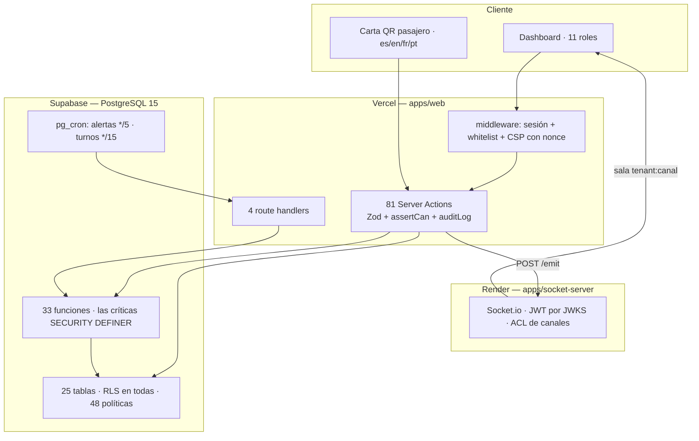

# Dorado Lounge System — Estado del Proyecto

**Informe de auditoría exhaustiva**

| Dato              | Valor                                                       |
| ----------------- | ----------------------------------------------------------- |
| Producto          | Dorado Lounge System — SaaS multi-tenant para sala VIP      |
| Cliente           | GISAT S.A. · Dorado Lounge · Aeropuerto El Dorado, Bogotá   |
| Repositorio       | `nkofla74-byte/dorado-lounge-system`                        |
| Commit auditado   | `828ab9d`                                                   |
| Rama              | `claude/repository-comprehensive-audit-vi1cr4`              |
| Fecha del informe | **2026-08-30**                                              |
| Método            | Lectura íntegra del código **+ ejecución real** del sistema |

> **Regla de este informe:** ninguna afirmación procede de la documentación del repositorio.
> Todo lo que aquí se declara terminado se demostró con código, y lo que se declara
> verificado se ejecutó. El detalle de cada comprobación está en
> [`docs/project-audit/23-evidence-index.md`](./project-audit/23-evidence-index.md).

---

## 1. Portada — qué se auditó y cómo

Se inspeccionó la totalidad del repositorio: 338 ficheros TypeScript, 78 componentes React,
80 migraciones SQL, 3 workflows de CI/CD, la configuración de cinco proyectos del monorepo y
las diez integraciones externas.

Además, **se ejecutó el sistema**:

| Comprobación                                      | Resultado                                      |
| ------------------------------------------------- | ---------------------------------------------- |
| `pnpm install --frozen-lockfile`                  | ✅ exit 0                                      |
| `pnpm typecheck` — TypeScript strict, 5 proyectos | ✅ **0 errores**                               |
| `pnpm lint`                                       | ✅ **0 avisos, 0 errores**                     |
| `pnpm test`                                       | ✅ **567 pruebas / 56 ficheros, todas verdes** |
| Cobertura del núcleo lógico                       | ✅ **91,53 %**                                 |
| `build` de producción                             | ✅ **29 rutas generadas**                      |
| `next start` + peticiones HTTP reales             | ✅ arranca; el guardia de sesión funciona      |
| 80 migraciones sobre PostgreSQL 16 limpio         | ✅ **aplican todas, sin un solo error**        |
| Arnés de RLS/RPC contra la base real              | ✅ **12 de 12 suites verdes**                  |

---

## 2. Resumen ejecutivo

**El núcleo operativo está construido, probado y desplegable. La capa analítica está rota. La
capa de tiempo real está construida pero conectada solo a medias.**

Todo el circuito que sostiene la operación de la sala funciona: recepción de mercancía con
merma, recetario con costes, producción por tandas, pedidos desde tres zonas, cuatro pantallas
de cocina con estado por plato, entrega con descuento FEFO atómico, requisiciones entre cocina
y almacén, turnos con jefe obligatorio y carta digital por QR en cuatro idiomas.

Se encontraron **cinco defectos funcionales**. Ninguno es una vulnerabilidad de seguridad;
todos son piezas que quedaron sin conectar:

| ID      | Severidad  | Qué ocurre                                                                                                                                                                                             |
| ------- | ---------- | ------------------------------------------------------------------------------------------------------------------------------------------------------------------------------------------------------ |
| **H-A** | 🔴 Crítico | La pantalla de Analítica devuelve `permission denied` a cualquier rol. Una migración creó la vista con privilegios del llamante y, en el mismo fichero, revocó al llamante el privilegio que necesita. |
| **H-B** | 🔴 Crítico | La analítica del superuser devuelve siempre cero filas: el camino cross-tenant usa una credencial sin `tenant_id`, y el filtro de la vista descarta todo.                                              |
| **H-C** | 🟠 Alto    | La campana de alertas escucha eventos pero nunca se une a ningún canal, así que no recibe nada en tiempo real.                                                                                         |
| **H-D** | 🟠 Alto    | La vista materializada de analítica no tiene refresco programado.                                                                                                                                      |
| **H-E** | 🟠 Alto    | Los pedidos por QR solo notifican a un canal: no despiertan la cocina AMEX ni pastelería.                                                                                                              |

Los cinco caen, sin excepción, en zonas del código que quedan fuera del alcance de las
pruebas automáticas. No es casualidad: es la mejor prueba de que el aparato de testing de este
repositorio **funciona donde llega**, y de dónde hay que extenderlo.

---

## 3. Objetivo del software

Responder con exactitud a tres preguntas que sin sistema se responden a ojo:

1. **¿Qué tengo?** Stock por insumo, por lote, con vencimiento y precio de compra.
2. **¿Qué gasté?** Coste real de cada plato, calculado con el precio de los lotes usados.
3. **¿Quién hizo qué y cuándo?** Cada pedido, movimiento y despacho, ligado a un turno y a una
   persona.

### El principio rector, y dónde vive

> **Nada sale de cocina sin receta.**

Está enforzado **en la base de datos**, no en la aplicación. Existe una prueba automática
(`f002_principio_rector.sql`) que intenta descontar inventario por escritura directa desde
PostgREST y verifica que el motor lo deniega. Se ejecutó en esta auditoría y pasa.

---

## 4. Arquitectura



**Monorepo pnpm** con cinco proyectos. **Trece módulos hexagonales** con la dirección de
dependencias `domain ← application ← infrastructure ← actions.ts` **enforzada por ESLint**,
no por buena voluntad.

**Autorización en cuatro capas**, con la autoridad en la más profunda:

| Capa | Dónde                                  | ¿Autoridad?  |
| ---- | -------------------------------------- | ------------ |
| 1    | Sidebar (`NAV_ITEMS`)                  | ❌ cosmética |
| 2    | Middleware (`canAccess`)               | ✅ servidor  |
| 3    | `assertCan()` + revalidación de sesión | ✅ servidor  |
| 4    | `fn_puede()` + RLS                     | ✅ **final** |

Detalle en [`02-architecture.md`](./project-audit/02-architecture.md).

---

## 5. Módulos

| Módulo          | Estado  | Nota                                                         |
| --------------- | ------- | ------------------------------------------------------------ |
| `inventory`     | 🟢 90 % | Merma en recepción, FEFO en SQL, 60 pruebas                  |
| `orders`        | 🟢 88 % | 17 acciones, 11 ficheros de prueba, entrega atómica          |
| `requisiciones` | 🟢 90 % | El único flujo con tiempo real completo de extremo a extremo |
| `cocina-amex`   | 🟢 90 % | Actualización optimista y limpieza correcta del socket       |
| `superuser`     | 🟢 90 % | CRUD de tenants y usuarios                                   |
| `proveedores`   | 🟢 90 % | CRUD + historial de compras                                  |
| `recipes`       | 🟢 85 % | Faltan editar y eliminar                                     |
| `turnos`        | 🟢 85 % | Bloques fijos, autocierre, `teamlider` obligatorio en base   |
| `costos`        | 🟢 85 % | Coste en tiempo real; N+1 resuelto                           |
| `production`    | 🟡 80 % | Materializa capa 2; contiene una acción muerta               |
| `alertas`       | 🟡 55 % | El motor funciona; la entrega en vivo no llega               |
| `analytics`     | ⚫ 20 % | **La base de datos no le deja leer**                         |

---

## 6. Funcionalidades

**18 completas · 9 parciales · 5 defectos funcionales.**

- Terminadas: [`17-completed-features.md`](./project-audit/17-completed-features.md)
- Parciales: [`18-partial-features.md`](./project-audit/18-partial-features.md)
- Pendientes: [`19-pending-features.md`](./project-audit/19-pending-features.md)

---

## 7. Pantallas

**24 páginas + 4 route handlers → 29 rutas en el build.**

5 públicas (login, QR, health, heartbeat, cron) y 21 del dashboard, cada una con su rol y su
guardia. Inventario completo, con botones, formularios y tablas, en:

- [`05-pages-and-routes.md`](./project-audit/05-pages-and-routes.md)
- [`06-components.md`](./project-audit/06-components.md) — los 78 componentes
- [`07-buttons-and-actions.md`](./project-audit/07-buttons-and-actions.md) — cada botón con su cadena hasta la base
- [`08-forms.md`](./project-audit/08-forms.md) — cada campo con su validación

---

## 8. Flujos

Seis flujos reconstruidos de punta a punta, con diagrama y estado:

| Flujo                        | Estado        |
| ---------------------------- | ------------- |
| Login + apertura de turno    | 🟢            |
| Recepción en bodega          | 🟢            |
| Pedido AMEX completo         | 🟢            |
| Requisición cocina → almacén | 🟢            |
| Pedido por QR                | 🟡 (H-E)      |
| Alertas automáticas          | 🟡 (H-C)      |
| Consulta de analítica        | ⚫ (H-A, H-B) |

Detalle en [`09-user-flows.md`](./project-audit/09-user-flows.md).

---

## 9. Roles

**11 roles activos + 2 inertes** por datos históricos. Matriz de 144 permisos, **generada**
desde TypeScript hacia SQL, con una prueba que falla si ambas divergen.

Verificado en base: RLS en las 25 tablas · 48 políticas · **0 políticas `FOR ALL`** ·
`authenticated` solo tiene `SELECT` sobre `pedidos`.

**No se confía en ocultar botones.** Matriz completa en
[`10-roles-and-permissions.md`](./project-audit/10-roles-and-permissions.md).

---

## 10. Base de datos

25 tablas · 48 políticas RLS · 33 funciones · 25 triggers · 109 índices (20 parciales) ·
67 claves foráneas · 15 ENUM.

Reglas de negocio en la base, no en la app: 7 CHECK que hacen cumplir el modelo,
`idempotency_key` UNIQUE en cuatro tablas, `audit_log` con hash chain SHA-256 e inmutable por
trigger.

ERD y detalle en [`11-database.md`](./project-audit/11-database.md).

---

## 11. Integraciones

Diez servicios externos. Nueve conectados; **Supabase Storage está documentado pero no se usa**.

Detalle en [`13-integrations.md`](./project-audit/13-integrations.md).

---

## 12. Seguridad

**La postura de seguridad es notablemente buena para el tamaño del proyecto.**

| Área                          | Estado                                                                  |
| ----------------------------- | ----------------------------------------------------------------------- |
| Secretos en el código         | 🟢 **0 coincidencias**                                                  |
| Autorización                  | 🟢 Cuatro capas, la última en Postgres, probada contra base real        |
| Multi-tenancy                 | 🟢 Enforzado en base, con 5 triggers antimezcla                         |
| CSP                           | 🟢 Nonce por petición, verificado en la respuesta real                  |
| XSS / SQL injection           | 🟢 0 usos de `dangerouslySetInnerHTML`, `eval` o SQL concatenado        |
| Auth máquina a máquina        | 🟢 `timingSafeEqual`, falla cerrado (verificado: HTTP 500)              |
| Cadena de suministro          | 🟢 `pnpm audit` como gate de CI, 9 overrides, acciones ancladas por SHA |
| Supresión de datos personales | 🟡 Incompleta: no anonimiza `public.users.nombre`                       |

Detalle en [`15-security-audit.md`](./project-audit/15-security-audit.md).

---

## 13. Testing

```
567 pruebas / 56 ficheros  →  todas verdes
12 suites de RLS contra PostgreSQL real  →  todas verdes
31 pruebas E2E de Playwright  →  código leído, no ejecutadas (exigen staging)
Cobertura del núcleo lógico: 91,53 %
```

**La letra pequeña, dicha con precisión:** ese 91,53 % se calcula sobre 2 279 de las 26 644
líneas de producción de `apps/web/src` — el **8,5 %**. Cubre el corazón algorítmico, que es
donde más importa, pero **los 15 297 renglones de componentes React no tienen ninguna prueba
funcional**.

Lo más valioso del aparato de pruebas es el arnés de RLS: aplica las 80 migraciones sobre un
Postgres limpio y comprueba la autorización **contra una base real**, simulando sesiones de
PostgREST. Es poco habitual encontrarlo.

Detalle en [`14-testing.md`](./project-audit/14-testing.md).

---

## 14. Funcionalidades terminadas

18, todas demostrables con código. Las principales:

1. Autenticación y control de acceso en cuatro capas
2. Recepción de mercancía con merma en recepción
3. Descuento FEFO atómico e idempotente
4. Matriz RBAC generada, con prueba antideriva
5. Escritura de pedidos exclusivamente por RPC
6. KDS por área con estado por plato
7. KDS AMEX con trazabilidad y cronómetros
8. Ciclo completo del pedido con entrega atómica
9. Requisiciones cocina → almacén
10. Producción por tandas con materialización de capa 2
11. Turnos con bloques fijos y autocierre
12. Carta digital QR multiidioma con cola offline
13. Motor de alertas (generación y persistencia)
14. Auditoría inmutable con hash chain
15. CSP con nonce por petición
16. Multi-tenancy enforzado en Postgres
17. CI/CD con 6 jobs y backups cifrados
18. Internacionalización es/en con paridad exacta (989 claves)

Evidencia por funcionalidad en
[`17-completed-features.md`](./project-audit/17-completed-features.md).

---

## 15. Funcionalidades parciales

| ID  | Funcionalidad                 | %   | Bloqueo                                      |
| --- | ----------------------------- | --- | -------------------------------------------- |
| P-1 | Analítica y reportes          | 20  | Conflicto `security_invoker` vs `REVOKE`     |
| P-2 | Alertas en tiempo real        | 55  | Falta el `join` al canal                     |
| P-3 | Tiempo real de pedidos QR     | 70  | Emite a un solo canal                        |
| P-4 | Modo offline del personal     | 40  | La cola solo sirve al QR del pasajero        |
| P-5 | Solicitudes a pastelería      | 10  | Backend eliminado, interfaz superviviente    |
| P-6 | Derecho de supresión          | 60  | No anonimiza el nombre                       |
| P-7 | Ciclo de vida de recetas      | 70  | Faltan editar, quitar ingrediente y eliminar |
| P-8 | Ajuste y conteo de inventario | 30  | Sin interfaz ni acción                       |
| P-9 | Almacenamiento de imágenes    | 30  | Storage documentado pero sin usar            |

---

## 16. Funcionalidades pendientes

**5 críticas** (los cinco hallazgos) · **8 altas** · **9 medias** · **13 bajas**.

Detalle y clasificación en
[`19-pending-features.md`](./project-audit/19-pending-features.md).

---

## 17. Problemas encontrados

### Los cinco hallazgos funcionales

Descritos en §2 y reproducidos con evidencia ejecutable en
[`23-evidence-index.md`](./project-audit/23-evidence-index.md) §A.5–A.7.

### Nueve contradicciones documentales

`CLAUDE.md` es el documento de máxima precedencia del repositorio, y hoy describe cosas que
no existen. Las dos más relevantes:

| Documentación                                 | Realidad                                                                                        |
| --------------------------------------------- | ----------------------------------------------------------------------------------------------- |
| Rol `chef` → ruta `/cocina`, "KDS supervisor" | El rol es inerte y **la ruta no existe**                                                        |
| Token QR de mesa: **4 h** de TTL              | `lib/qr/token.ts`: **12 h**. El tracker dio F-028 por cerrado, pero `CLAUDE.md` no se actualizó |

Las nueve, en [`23-evidence-index.md`](./project-audit/23-evidence-index.md) §B.

### Un cierre de remediación que no se sostiene

`REMEDIATION_TRACKER.md` marca F-005 («vistas materializadas nunca pobladas») como
**Verificado** con «riesgo residual: Ninguno». La vista efectivamente **se puebla** — pero
**no se puede leer**. La prueba `f005_analytics_refrescable` cubre el refresco y nunca intenta
un `SELECT` como `authenticated`. Ese es exactamente el hueco por el que pasó H-A.

---

## 18. Deuda técnica

| Prioridad     |  Nº | Ejemplos                                                                              |
| ------------- | --: | ------------------------------------------------------------------------------------- |
| 🔴 Crítica    |   2 | H-A, H-B                                                                              |
| 🟠 Alta       |   4 | H-C, H-D, H-E, check de stock mínimo sin cubrir el consumo real                       |
| 🟡 Media      |   9 | Código muerto del refoco, cobertura estrecha, Storage sin usar, `next lint` deprecado |
| ⚪ Baja       |  13 | Componentes sobredimensionados, bundle pesado, `assertCan` sin caché                  |
| 📄 Documental |   9 | Contradicciones `CLAUDE.md` ↔ código                                                  |

Detalle en [`20-technical-debt.md`](./project-audit/20-technical-debt.md).

---

## 19. Roadmap

Seis fases. **Sin estimaciones de tiempo**: no hay evidencia en el repositorio sobre velocidad
del equipo que permita convertir complejidad en horas. La complejidad se expresa en escala
relativa (XS…XL).

| Fase                               | Objetivo                                                            |
| ---------------------------------- | ------------------------------------------------------------------- |
| 1 · Correcciones críticas          | Que ninguna pantalla entregada devuelva un error                    |
| 2 · Completar lo que está a medias | Recetas, supresión GDPR, imágenes, limpiar código muerto            |
| 3 · Funcionalidades faltantes      | Conteo de inventario, dimensiones de analítica, cola offline        |
| 4 · Seguridad y calidad            | Segunda capa en `/admin`, grants, rotación de claves                |
| 5 · Testing                        | Prueba de coherencia de canales, Testing Library                    |
| 6 · Producción                     | Configuración externa, monitor de `/health`, prueba de restauración |

### La ruta más corta al valor

```
1.2 (prueba en rojo) → 1.1 (una línea) → 1.4 (una línea) → 1.3 → 1.5 → 1.6
```

Cinco cambios pequeños que resuelven los cinco hallazgos principales.

Detalle con criterios de aceptación en
[`21-roadmap.md`](./project-audit/21-roadmap.md).

---

## 20. Estado real del proyecto — matriz ejecutiva

### Metodología del porcentaje

**Los porcentajes no son una impresión.** Cada área se puntúa sobre tres factores
verificables, con estos pesos:

| Factor            | Peso | Cómo se mide                                                                                                                                     |
| ----------------- | ---: | ------------------------------------------------------------------------------------------------------------------------------------------------ |
| **Funcionalidad** | 50 % | ¿Existen las funciones que el área promete, y hacen lo que dicen? Se cuenta sobre el inventario de funcionalidades verificadas en el código      |
| **Integración**   | 30 % | ¿Está la cadena completa conectada (UI → acción → permiso → base → respuesta → error)? Un extremo suelto la reduce a 0 aunque las partes existan |
| **Verificación**  | 20 % | ¿Hay prueba automática que la cubra? Se puntúa por cobertura real medida, no por existencia de una carpeta `tests/`                              |

Una funcionalidad presente pero desconectada puntúa alto en Funcionalidad y **cero** en
Integración: por eso `alertas` queda en 55 % pese a tener el motor completo y probado.

### Matriz

| Área                       | Func. | Integr. | Verif. |   **Total** | Evidencia                                                                | Pendiente                                                             |
| -------------------------- | ----: | ------: | -----: | ----------: | ------------------------------------------------------------------------ | --------------------------------------------------------------------- |
| **Base de datos y RLS**    |   100 |      95 |     90 | **🟢 95 %** | 25 tablas, 48 políticas, 12 suites de RLS verdes, 80 migraciones aplican | Grants anchos en `audit_log`; `alertas` UPDATE con permiso de lectura |
| **Autenticación**          |   100 |      95 |     85 | **🟢 95 %** | Redirección verificada en ejecución; 11+15+4+5 pruebas                   | Política de contraseñas débil                                         |
| **Roles y permisos**       |   100 |      95 |     85 | **🟢 95 %** | 144 filas de RBAC generadas y verificadas; prueba antideriva             | `assertCan` ausente en 2 páginas de admin                             |
| **Despliegue / CI**        |    95 |      90 |     80 | **🟢 90 %** | 6 jobs de CI, backups cifrados, acciones ancladas                        | Configuración externa sin verificar                                   |
| **Inventario**             |    90 |      95 |     90 | **🟢 90 %** | FEFO en SQL, 35 pruebas de merma, cobertura del 90 % exigida             | Sin ajuste ni conteo físico                                           |
| **Requisiciones**          |    95 |     100 |     75 | **🟢 90 %** | Único flujo con tiempo real completo                                     | —                                                                     |
| **Seguridad**              |    95 |      90 |     75 | **🟢 88 %** | 0 secretos, CSP con nonce verificada, endpoints fail-closed              | Supresión GDPR incompleta                                             |
| **Pedidos y KDS**          |    95 |      85 |     85 | **🟢 88 %** | 17 acciones, 11 ficheros de prueba, `f008`+`f009` verdes                 | H-E: canales del QR                                                   |
| **Recetas y costos**       |    85 |      90 |     80 | **🟢 85 %** | N+1 resuelto, `f021` verde                                               | Sin editar ni eliminar                                                |
| **Turnos**                 |    90 |      85 |     80 | **🟢 85 %** | `teamlider` obligatorio en base, autocierre por cron                     | —                                                                     |
| **Pantallas y navegación** |    90 |      80 |     70 | **🟡 82 %** | 29 rutas en el build; 21 pantallas operativas                            | 1 pantalla rota, 1 panel vacío                                        |
| **Documentación**          |    90 |      70 |     60 | **🟡 75 %** | ARCHITECTURE (90 KB), ADRs, tracker, runbooks                            | 9 contradicciones con el código                                       |
| **Testing**                |    85 |      70 |     55 | **🟡 72 %** | 567 pruebas verdes + 12 suites de RLS                                    | Cobertura sobre el 8,5 % del código; 0 pruebas de componentes         |
| **Integraciones**          |    80 |      70 |     50 | **🟡 70 %** | 9 de 10 conectadas                                                       | Storage sin usar; latido diario                                       |
| **Tiempo real**            |    90 |      45 |     40 | **🟡 60 %** | 7 de 11 canales conectados de extremo a extremo                          | H-C, H-E; 4 canales muertos                                           |
| **Alertas**                |    90 |      25 |     70 | **🟡 55 %** | Motor y deduplicación probados                                           | H-C; check de stock sin cubrir el consumo real                        |
| **Modo offline**           |    70 |      25 |     10 | **🟡 40 %** | Cola IndexedDB funcional                                                 | Solo sirve al QR del pasajero                                         |
| **Analítica y reportes**   |    40 |       0 |     30 | **⚫ 20 %** | Módulo completo; **la base no le deja leer**                             | H-A, H-B, H-D; faltan dos dimensiones                                 |

### Total ponderado

Ponderando cada área por su peso en la operación diaria de la sala (el circuito
bodega → cocina → sala pesa más que la analítica o el modo offline):

> ## **≈ 80 %**

Con una precisión importante: **ese 20 % restante no está repartido de forma uniforme.**
Se concentra en dos zonas concretas —la analítica y el cableado de tiempo real— y **más de la
mitad de él se recupera con los seis cambios de la Fase 1**, ninguno de los cuales supera la
complejidad "S".

---

## Conclusión

### 🟢 COMPLETADO

18 funcionalidades, entre ellas todo el circuito operativo de la sala. La base de datos, la
autorización y la seguridad son la parte más fuerte del proyecto: las reglas críticas están
grabadas en Postgres y hay 12 pruebas automáticas que lo verifican contra una base real.

### 🟡 PARCIAL

9 funcionalidades a medias. La constante es la misma en casi todas: **las piezas existen y
funcionan por separado, pero un extremo quedó sin conectar.** La campana escucha un evento al
que nadie la suscribió; la cola offline sirve solo al pasajero; el QR notifica a un canal de
tres.

### 🔴 PENDIENTE

5 tareas críticas, 8 altas. Las cinco críticas son los cinco hallazgos, y las cinco se
resuelven con cambios pequeños y localizados.

### ⚫ PROBLEMAS CRÍTICOS

**La pantalla de Analítica no funciona.** Es el único punto del sistema que está entregado y
devuelve un error. La causa está identificada con precisión y reproducida con SQL: una
migración de mayo creó la vista con privilegios del llamante y, en el mismo fichero, revocó al
llamante el privilegio que necesitaba. **La corrección es de una línea.**

Sobrevivió a una auditoría forense porque la prueba que la cubría verificaba que la vista se
_refresca_, no que se pueda _leer_.

### 📊 ESTADO GENERAL

> **≈ 80 %.** Un producto con un núcleo operativo sólido, disciplina de ingeniería
> verificable y dos zonas de sombra bien delimitadas. No tiene un problema de rigor: tiene un
> problema de **alcance de su red de seguridad**. Los cinco defectos encontrados caen, sin
> excepción, en el código que las pruebas automáticas no alcanzan.

### 🚀 SIGUIENTE PASO RECOMENDADO

**Escribir primero la prueba en rojo, después el arreglo** — que es la regla del propio
repositorio:

1. Añadir `fXXX_analytics_legible.sql`, que lea la vista como `authenticated`. **Debe fallar.**
2. Recrear la vista sin `security_invoker`. La prueba pasa. → **H-A resuelto**
3. Programar el refresco con `cron.schedule`. → **H-D resuelto**
4. Corregir el camino del superuser. → **H-B resuelto**
5. Añadir el `join` de canales en `AlertasBell`. → **H-C resuelto**
6. Reutilizar la lógica de canales de `createPedido` en el alta por QR. → **H-E resuelto**

---

## Documentos generados

| Ruta                                             | Contenido                                      |
| ------------------------------------------------ | ---------------------------------------------- |
| `docs/PROJECT_STATUS.md`                         | **Este documento** — informe principal         |
| `docs/project-audit/00-executive-summary.md`     | Resumen ejecutivo                              |
| `docs/project-audit/01-project-overview.md`      | Visión general y métricas                      |
| `docs/project-audit/02-architecture.md`          | Arquitectura y diagramas                       |
| `docs/project-audit/03-technology-stack.md`      | Stack, versiones y configuración               |
| `docs/project-audit/04-modules.md`               | Los 13 módulos, uno a uno                      |
| `docs/project-audit/05-pages-and-routes.md`      | Las 24 páginas y 4 route handlers              |
| `docs/project-audit/06-components.md`            | Los 78 componentes                             |
| `docs/project-audit/07-buttons-and-actions.md`   | Cada botón y su cadena hasta la base           |
| `docs/project-audit/08-forms.md`                 | Cada formulario y su validación                |
| `docs/project-audit/09-user-flows.md`            | Seis flujos con diagramas                      |
| `docs/project-audit/10-roles-and-permissions.md` | Matriz de 144 permisos y las 4 capas           |
| `docs/project-audit/11-database.md`              | 25 tablas, ERD, funciones, índices             |
| `docs/project-audit/12-api-and-services.md`      | 81 acciones, 4 endpoints, contrato de socket   |
| `docs/project-audit/13-integrations.md`          | Diez integraciones externas                    |
| `docs/project-audit/14-testing.md`               | 567 pruebas, cobertura y sus límites           |
| `docs/project-audit/15-security-audit.md`        | Auditoría de seguridad independiente           |
| `docs/project-audit/16-code-quality.md`          | Calidad, rendimiento, mantenibilidad           |
| `docs/project-audit/17-completed-features.md`    | Las 18 funcionalidades terminadas              |
| `docs/project-audit/18-partial-features.md`      | Las 9 parciales, con qué falta a cada una      |
| `docs/project-audit/19-pending-features.md`      | Pendientes por prioridad                       |
| `docs/project-audit/20-technical-debt.md`        | Deuda técnica priorizada                       |
| `docs/project-audit/21-roadmap.md`               | Roadmap en 6 fases con criterios de aceptación |
| `docs/project-audit/22-client-presentation.md`   | **Versión para el cliente, sin tecnicismos**   |
| `docs/project-audit/23-evidence-index.md`        | Evidencia ejecutada y contradicciones          |

---

_Auditoría realizada el 2026-08-30 sobre el commit `828ab9d`. Durante su realización no se
modificó una sola línea de código de producción: el trabajo fue leer, analizar, validar,
documentar y reportar._
