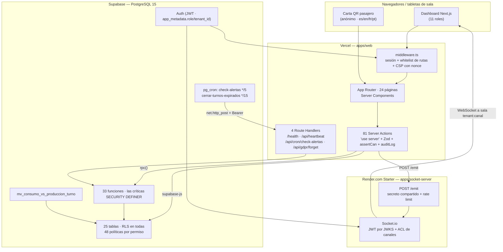
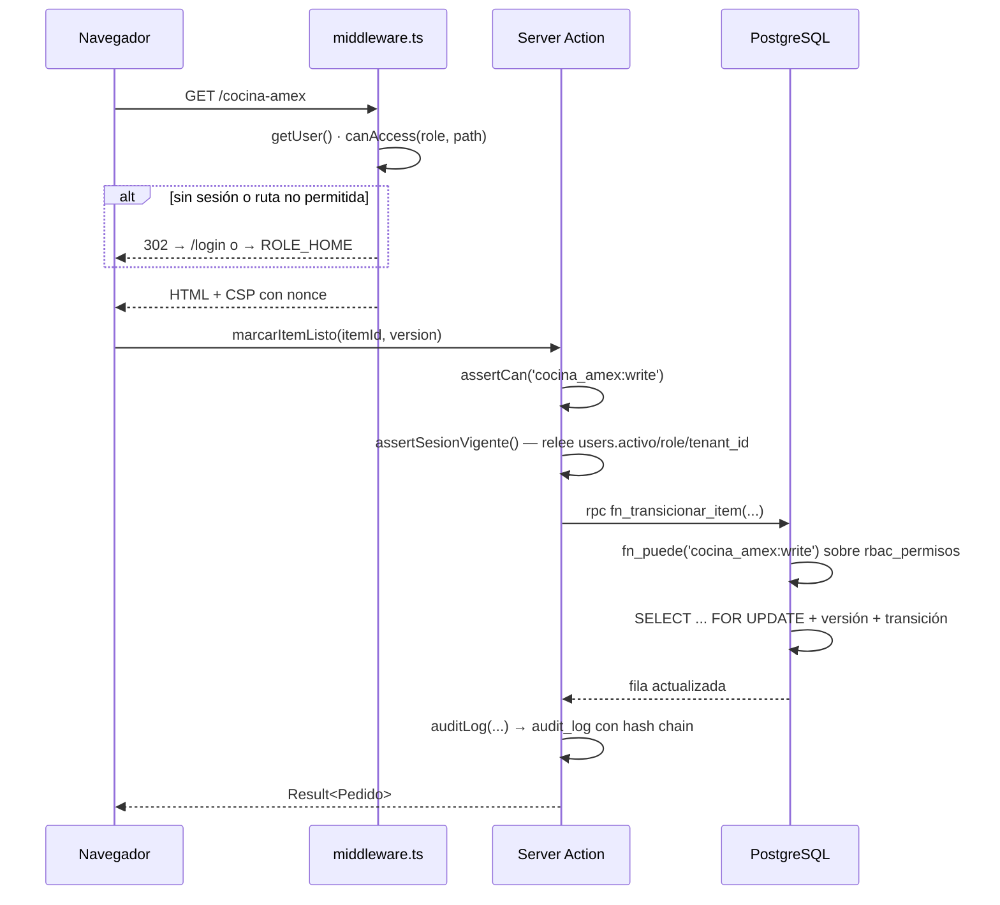
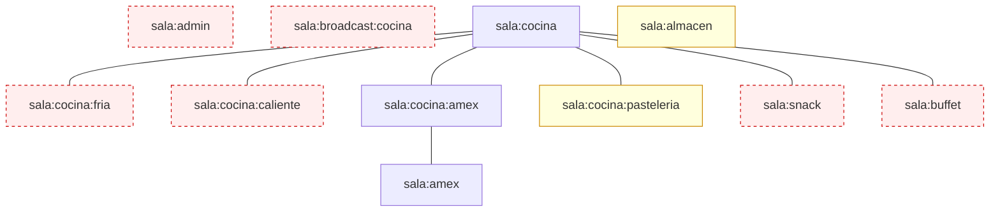

# 02 · Arquitectura

## 1. Mapa lógico



## 2. Monorepo

```
apps/web/              Next.js 15 App Router — UI + Server Actions      (~24 000 LOC)
apps/socket-server/    Node.js + Socket.io con auth JWT                 (~600 LOC)
packages/shared-types/       Contratos web ↔ socket (fuente de verdad)
packages/shared-validation/  Esquemas Zod reutilizables
packages/eslint-config/      Configuración ESLint compartida
supabase/migrations/         80 ficheros SQL idempotentes
scripts/sql-harness/         Arnés de pruebas RLS/RPC contra Postgres real
```

**Verificado:** `pnpm-workspace.yaml` declara `apps/*` y `packages/*`. Los cinco proyectos con
script `typecheck` compilan sin error.

## 3. Módulos hexagonales

Trece módulos bajo `apps/web/src/modules/<nombre>/` con estructura rígida:

```
domain/          Lógica pura. Sin imports externos ni @supabase/*
application/     Casos de uso. Solo importa domain/ y ports/
infrastructure/  Adaptadores Supabase. Implementa los ports
actions.ts       ÚNICA superficie pública (Server Actions)
tests/
```

Dirección de dependencias `domain ← application ← infrastructure ← actions.ts`,
enforzada por ESLint (`packages/eslint-config/index.js`).

| Módulo          | Estado | Superficie pública                                                             |
| --------------- | ------ | ------------------------------------------------------------------------------ |
| `inventory`     | 🟢     | 8 acciones — insumos, lotes, FEFO, merma, importación masiva                   |
| `recipes`       | 🟢     | 4 acciones — recetas, ingredientes, metadatos de menú                          |
| `production`    | 🟡     | 7 acciones — tandas; `getSolicitudesCocina` devuelve `[]` fijo (código muerto) |
| `orders`        | 🟢     | 17 acciones — la más grande; pedidos, ítems, trazabilidad, carta               |
| `turnos`        | 🟢     | 6 acciones — apertura/cierre, turno activo                                     |
| `analytics`     | ⚫     | 2 acciones — **la lectura falla en base** (ver `20-technical-debt.md` H-A/H-B) |
| `superuser`     | 🟢     | 7 acciones — CRUD de tenants y usuarios                                        |
| `cocina-amex`   | 🟢     | 5 acciones — KDS AMEX con trazabilidad                                         |
| `proveedores`   | 🟢     | 5 acciones — CRUD + historial de compras                                       |
| `alertas`       | 🟡     | 6 acciones — el motor funciona; el tiempo real no llega a la campana           |
| `costos`        | 🟢     | 2 acciones — coste en tiempo real vía `fn_costo_receta`                        |
| `requisiciones` | 🟢     | 6 acciones — cocina → almacén con locking optimista                            |

> `analytics` es de solo lectura por diseño: proyecta vistas materializadas, nunca escribe.

## 4. Autorización en dos capas



**Capa 1 — `assertCan()`** (`lib/auth/assertCan.ts`): valida el JWT, **y además vuelve a leer
la fila del usuario** para detectar cuentas desactivadas o con rol cambiado tras el login
(cierre del hallazgo F-003).

**Capa 2 — `fn_puede()`** en Postgres, contra la tabla `rbac_permisos`, que se **genera**
desde `lib/auth/permissions.ts` con `pnpm rbac:generate`. Una prueba de Vitest falla si
alguien cambia una sin regenerar la otra.

**Verificado en base:** `rbac_permisos` contiene exactamente 144 filas, tantas como el bloque
generado de la migración `20260822000002_rbac_matriz.sql`.

## 5. Escritura de pedidos: solo por RPC

Desde la remediación del 2026-08-22, `authenticated` **no tiene** `INSERT` ni `UPDATE` sobre
`pedidos`, `pedido_items`, `pedido_eventos` ni `pedido_item_eventos`.

**Verificado ejecutando** sobre la base reconstruida:

```
grants de 'authenticated' sobre public.pedidos → SELECT
políticas con cmd='ALL' en el esquema public   → 0
```

Toda mutación pasa por RPCs `SECURITY DEFINER` que derivan tenant, rol y usuario de
`auth.jwt()` —nunca de parámetros— y trabajan con `FOR UPDATE`:

| RPC                          | Uso                                            |
| ---------------------------- | ---------------------------------------------- |
| `fn_crear_pedido`            | Alta interna (exige `orders:create`)           |
| `fn_crear_pedido_qr`         | Alta desde el QR del pasajero (`service_role`) |
| `fn_pedido_transicion`       | Transiciones sin movimiento de inventario      |
| `fn_entregar_pedido`         | Entrega: descuento FEFO + transición, atómico  |
| `fn_pedido_asignar_cocinero` | Asignación de responsable                      |
| `fn_transicionar_item`       | Estado por ítem + estado agregado del pedido   |

## 6. Topología de tiempo real



Los canales en rojo están **declarados en el contrato y en el ACL, pero ningún cliente se une
a ellos**; los eventos que se emiten ahí se pierden. Detalle y evidencia en
[`12-api-and-services.md §5`](./12-api-and-services.md) y [`20-technical-debt.md`](./20-technical-debt.md).

**Regla arquitectónica cumplida:** persistencia primero, broadcast después. `emitEvent()`
tiene timeout de 1 500 ms y falla en silencio: si el socket cae, el evento sigue en la base
para reconciliación.

## 7. Infraestructura

| Pieza          | Dónde                                                                  | Evidencia                                              |
| -------------- | ---------------------------------------------------------------------- | ------------------------------------------------------ |
| Web            | Vercel                                                                 | `.github/workflows/deploy.yml`, `apps/web/vercel.json` |
| Socket         | Render.com plan Starter                                                | `render.yaml` (sin hibernación, healthcheck `/health`) |
| Base de datos  | Supabase PostgreSQL 15                                                 | `supabase/migrations/`                                 |
| Migraciones    | Integración nativa Supabase ↔ GitHub al fusionar en `main`             | ADR-007; el job `migrate` se retiró el 2026-08-25      |
| Backups        | GitHub Actions diario 03:00 UTC → artifact cifrado GPG (+ S3 opcional) | `.github/workflows/backup.yml`                         |
| Observabilidad | Sentry · Axiom · Better Stack                                          | `next.config.mjs`, `instrumentation.ts`                |
| Rate limiting  | Upstash Redis                                                          | `lib/rate-limit.ts` — 5 buckets                        |

**No hay Docker en el flujo de desarrollo, y es deliberado** (`CLAUDE.md`: nunca
`supabase start` ni Docker local). El arnés de pruebas SQL levanta un cluster efímero con las
herramientas nativas de PostgreSQL.
