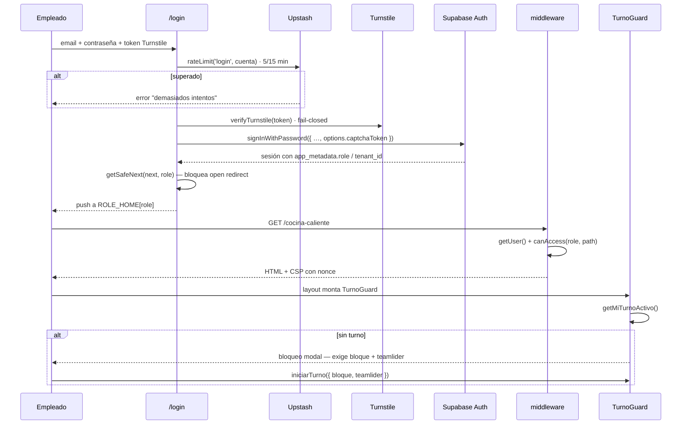
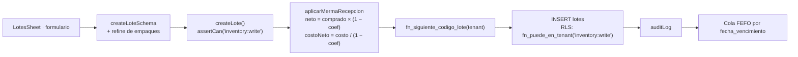
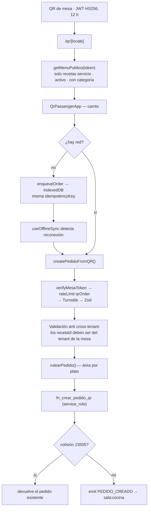
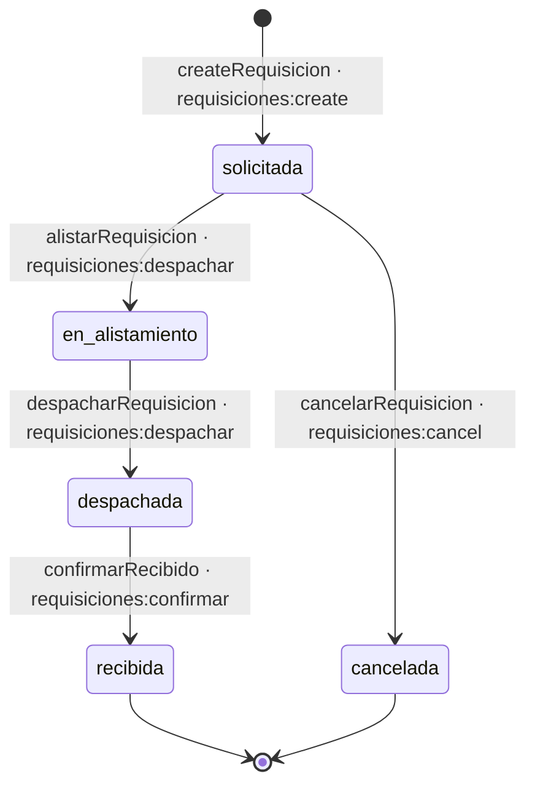
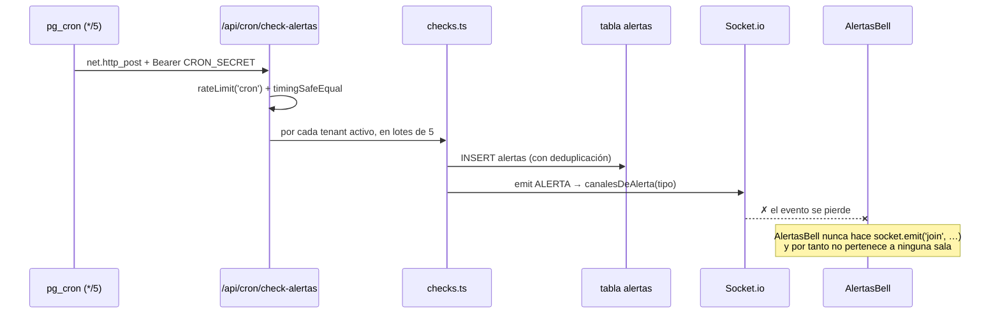

# 09 · Flujos de usuario

Seis flujos reconstruidos leyendo el código de punta a punta. Para cada uno: la versión
para el cliente, la técnica, el diagrama, los ficheros y su estado real.

---

## Flujo 1 · Inicio de sesión y apertura de turno

### Para el cliente

El empleado entra con su correo y contraseña. El sistema comprueba que no sea un robot,
verifica que su cuenta siga activa y lo lleva directamente a **su** pantalla: el chef de
cocina caliente a su KDS, el almacenero a bodega, el mesero a pedidos. Antes de poder
trabajar debe abrir turno indicando quién es el jefe de turno. Sin turno abierto, no se
puede operar.

### Técnico



**Ficheros:** `app/(auth)/login/{page,actions}.tsx` · `lib/auth/login-throttle.ts` ·
`lib/turnstile/verify.ts` · `middleware.ts` · `lib/auth/role-home.ts` ·
`components/turnos/turno-guard.tsx` · `modules/turnos/actions.ts`

**Estado: 🟢 completo.** 11 pruebas de login, 15 de `role-home`, 4 de rutas públicas,
5 de throttle, 2 de Turnstile. **Redirección verificada en ejecución**: `GET /inventario`
sin sesión → `302 → /login?next=%2Finventario`.

---

## Flujo 2 · Recepción de mercancía en bodega

### Para el cliente

Llega el proveedor. El almacenero registra el lote: qué insumo, cuánto, de qué proveedor, a
qué precio y con qué fecha de vencimiento. El sistema **descuenta automáticamente la merma
de recepción** (lo que se pierde al limpiar o pelar) y guarda la cantidad neta, la que
realmente se puede cocinar. El precio por unidad se ajusta para que el valor total del lote
no cambie. A partir de ese momento el lote entra en la cola FEFO: se consume primero lo que
vence antes.

### Técnico



**Ficheros:** `components/inventory/lotes-sheet.tsx` · `nuevo-ingreso-dialog.tsx` ·
`modules/inventory/domain/merma.ts` · `modules/inventory/actions.ts` ·
`supabase/migrations/20260530000001_merma_recepcion.sql`

**Estado: 🟢 completo.** 35 pruebas solo del dominio de merma. Cobertura exigida 90 %.

---

## Flujo 3 · Pedido AMEX de punta a punta

### Para el cliente

El mesero toma el pedido en la tableta. Aparece al instante en la pantalla de la cocina AMEX
con un cronómetro corriendo. El cocinero lo recibe, empieza a prepararlo, marca cada plato
como listo y lo despacha. El mesero confirma la entrega, y **en ese momento** el sistema
descuenta del inventario todos los ingredientes de todas las recetas del pedido, cogiendo
siempre los lotes que vencen antes.

### Técnico

```mermaid
sequenceDiagram
  participant M as Mesero (/pedidos)
  participant SA as Server Actions
  participant PG as PostgreSQL
  participant SK as Socket.io
  participant K as KDS AMEX

  M->>SA: createPedido({ zona:'amex', items, idempotencyKey })
  SA->>SA: assertCan('orders:create') + Zod + rutearPedido()
  SA->>PG: fn_crear_pedido(...)  — pedido + ítems en 1 transacción
  PG-->>SA: pedido (estado 'creado', version 1)
  SA->>PG: auditLog
  SA->>SK: emit PEDIDO_CREADO → sala:cocina, sala:cocina:amex
  SK-->>K: evento; el tablero refresca y suena el toast
  K->>SA: recibirPedidoAmex(id, v)   → fn_pedido_transicion
  K->>SA: iniciarPreparacionAmex     → en_preparacion
  K->>SA: iniciarItem / marcarItemListo (por plato) → fn_transicionar_item
  K->>SA: despacharPedidoAmex        → despachado
  M->>SA: entregarPedido(id, v)
  SA->>PG: fn_entregar_pedido(pedido, version)
  Note over PG: FOR UPDATE · descuento FEFO de todos<br/>los ingredientes · transición a 'entregado'<br/>TODO en una transacción
  PG-->>SA: pedido entregado
  SA->>SK: emit PEDIDO_ESTADO → sala:cocina, sala:amex
```

**Estado: 🟢 completo y probado en base.** Pruebas de RLS `f008_entrega_atomica` y
`f009_transicion_item_atomica` — ambas pasan. Además 11 ficheros de prueba en `modules/orders`.

**Detalle:** el estado del pedido se recalcula a partir del estado de sus ítems dentro de
`fn_transicionar_item`; el cliente nunca lo decide.

---

## Flujo 4 · Pedido desde el QR del pasajero

### Para el cliente

El pasajero escanea el QR de su mesa, ve la carta con fotos e ingredientes en su idioma
(español, inglés, francés o portugués), elige y pide. No necesita instalar nada ni
registrarse. Si se queda sin cobertura, el pedido se guarda en su móvil y se envía solo
cuando vuelve la red, sin duplicarse.

### Técnico



**Estado: 🟡 parcial.** El alta funciona y está bien blindada (8 pruebas en
`qr-actions.test.ts`). Dos problemas:

- **H-E** — solo emite a `sala:cocina`. El alta interna emite además a `sala:cocina:amex` y
  `sala:cocina:pasteleria`. Un pedido QR de un postre no despierta la pantalla de pastelería.
- **F-028** — el TTL real del token es **12 h**, no las 4 h que declara `CLAUDE.md`.

---

## Flujo 5 · Requisición de cocina al almacén

### Para el cliente

El cocinero pide insumos al almacén desde su propia pantalla. El almacenero lo ve al instante
en su cola, lo alista, lo despacha anotando las cantidades reales y el cocinero confirma que
lo recibió. Todo queda ligado al turno.

### Técnico



Cada transición: `assertCan` → `findById` → `guardArea(rol, área)` → caso de uso con
_optimistic locking_ por `version` → `auditLog` → `emitEstado` a `sala:almacen`.

**Estado: 🟢 completo.** Es el **único flujo del sistema cuyo tiempo real funciona de
extremo a extremo**: `RequisicionesPanel` sí se une al canal `sala:almacen`.

`guardArea` valida el **área**, no la identidad del solicitante, porque los turnos rotan.
Decisión de dominio bien razonada.

---

## Flujo 6 · Alertas automáticas

### Para el cliente

Cada cinco minutos el sistema revisa si hay lotes por vencer, stock bajo mínimo o pedidos
AMEX demorados, y genera avisos para quien corresponda.

### Técnico



**Estado: 🟡 parcial.**

- Generación y persistencia: ✅ funcionan (10 pruebas de deduplicación).
- Autenticación del cron: ✅ correcta, verificada en ejecución (500 sin secreto, 401 con
  token erróneo).
- Enrutado de canales: ✅ correcto en el dominio (5 pruebas).
- **Entrega en tiempo real: ✗ rota** — hallazgo H-C.

El usuario sí ve las alertas, pero solo al recargar la página o al abrir el panel de la
campana. No hay notificación push real.

---

## Resumen

| Flujo                        | Estado | Bloqueo                                             |
| ---------------------------- | ------ | --------------------------------------------------- |
| Login + apertura de turno    | 🟢     | —                                                   |
| Recepción en bodega          | 🟢     | —                                                   |
| Pedido AMEX completo         | 🟢     | —                                                   |
| Pedido por QR                | 🟡     | H-E (canales) · F-028 (TTL documentado)             |
| Requisición cocina → almacén | 🟢     | —                                                   |
| Alertas automáticas          | 🟡     | H-C (la campana no se une a ningún canal)           |
| **Consulta de analítica**    | ⚫     | **H-A y H-B — la pantalla no puede leer sus datos** |
