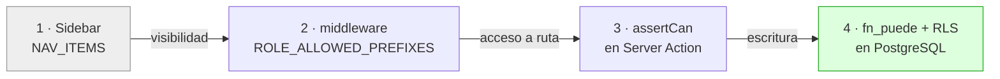

# 10 · Roles y permisos

## 1. Roles reales

Fuente: `packages/shared-types/src/enums.ts` (aplicación) y el ENUM `user_role` de Postgres.

| Rol                    | Home               | Estado                                             |
| ---------------------- | ------------------ | -------------------------------------------------- |
| `superuser`            | `/admin/tenants`   | 🟢 activo — bypass total de la matriz              |
| `admin`                | `/inventario`      | 🟢 activo                                          |
| `chef_cocina_fria`     | `/cocina-fria`     | 🟢 activo                                          |
| `chef_cocina_caliente` | `/cocina-caliente` | 🟢 activo                                          |
| `sous_chef`            | `/cocina-amex`     | 🟢 activo                                          |
| `mesero_amex`          | `/pedidos`         | 🟢 activo                                          |
| `personal_almacen`     | `/almacen`         | 🟢 activo                                          |
| `personal_pasteleria`  | `/pasteleria`      | 🟢 activo                                          |
| `personal_snack`       | `/snack`           | 🟢 activo                                          |
| `personal_buffet`      | `/buffet`          | 🟢 activo                                          |
| `steward`              | `/produccion`      | 🟢 activo                                          |
| `chef`                 | —                  | ⚪ **inerte** — deprecado en el refoco operacional |
| `recepcion`            | —                  | ⚪ **inerte** — retirado con vuelos/afluencia      |

Los dos inertes siguen en el ENUM SQL porque **Postgres no permite eliminar un valor de un
ENUM** y hay datos históricos. Están fuera de `UserRole` en TypeScript, así que no son
asignables ni navegables.

> ⚠️ **Contradicción documental.** `CLAUDE.md` sigue listando `chef` → `/cocina` como "KDS
> supervisor". Ni el rol es asignable ni la ruta existe. Ver §7.

---

## 2. Matriz de permisos — la de verdad

Fuente única: `apps/web/src/lib/auth/permissions.ts`, del que se **genera** la tabla SQL
`rbac_permisos` con `pnpm rbac:generate`.

**Verificado en base reconstruida: `SELECT count(*) FROM rbac_permisos` → 144 filas**,
exactamente las mismas que el bloque generado de `20260822000002_rbac_matriz.sql`.

Leyenda: ● concedido · — denegado. `superuser` no aparece: tiene bypass total en `assertCan()`.

| Permiso                      | admin | chef_fría | chef_cal. | sous_chef | mesero | almacén | pastel. | snack | buffet | steward |
| ---------------------------- | :---: | :-------: | :-------: | :-------: | :----: | :-----: | :-----: | :---: | :----: | :-----: |
| `inventory:read`             |   ●   |     ●     |     ●     |     ●     |   —    |    ●    |    ●    |   —   |   —    |    ●    |
| `inventory:write`            |   ●   |     —     |     —     |     ●     |   —    |    ●    |    —    |   —   |   —    |    —    |
| `inventory:stock_out`        |   ●   |     —     |     —     |     ●     |   —    |    —    |    —    |   —   |   —    |    —    |
| `inventory:merma`            |   ●   |     —     |     —     |     ●     |   —    |    ●    |    —    |   —   |   —    |    —    |
| `recipes:read`               |   ●   |     ●     |     ●     |     ●     |   ●    |    —    |    ●    |   ●   |   ●    |    —    |
| `recipes:write`              |   ●   |     —     |     —     |     —     |   —    |    —    |    —    |   —   |   —    |    —    |
| `production:read`            |   ●   |     ●     |     ●     |     ●     |   —    |    —    |    ●    |   ●   |   ●    |    ●    |
| `production:write`           |   ●   |     ●     |     ●     |     ●     |   —    |    —    |    ●    |   —   |   —    |    ●    |
| `orders:read`                |   ●   |     ●     |     ●     |     ●     |   ●    |    —    |    ●    |   ●   |   ●    |    —    |
| `orders:create`              |   ●   |     —     |     —     |     —     |   ●    |    —    |    —    |   ●   |   ●    |    —    |
| `orders:receive`             |   ●   |     ●     |     ●     |     ●     |   ●    |    —    |    —    |   —   |   —    |    —    |
| `orders:dispatch`            |   ●   |     ●     |     ●     |     ●     |   —    |    —    |    —    |   —   |   —    |    —    |
| `orders:deliver`             |   ●   |     —     |     —     |     —     |   ●    |    —    |    —    |   ●   |   ●    |    —    |
| `orders:cancel`              |   ●   |     ●     |     ●     |     ●     |   ●    |    —    |    —    |   ●   |   ●    |    —    |
| `orders:trace`               |   ●   |     —     |     —     |     —     |   —    |    —    |    —    |   —   |   —    |    —    |
| `analytics:read`             |   ●   |     —     |     —     |     —     |   —    |    —    |    —    |   —   |   —    |    —    |
| `analytics:refresh`          |   ●   |     —     |     —     |     —     |   —    |    —    |    —    |   —   |   —    |    —    |
| `turnos:read` / `:write`     |   ●   |     ●     |     ●     |     ●     |   ●    |    ●    |    ●    |   ●   |   ●    |    ●    |
| `users:read` / `:write`      |   ●   |     —     |     —     |     —     |   —    |    —    |    —    |   —   |   —    |    —    |
| `tenants:read` / `:write`    |   —   |     —     |     —     |     —     |   —    |    —    |    —    |   —   |   —    |    —    |
| `cocina_amex:read/write`     |   ●   |     —     |     —     |     ●     |   —    |    —    |    —    |   —   |   —    |    —    |
| `cocina_fria:read/write`     |   ●   |     ●     |     —     |     —     |   —    |    —    |    —    |   —   |   —    |    —    |
| `cocina_caliente:read/write` |   ●   |     —     |     ●     |     —     |   —    |    —    |    —    |   —   |   —    |    —    |
| `pasteleria:read/write`      |   ●   |     —     |     —     |     —     |   —    |    —    |    ●    |   —   |   —    |    —    |
| `proveedores:read/write`     |   ●   |     —     |     —     |     —     |   —    |    ●    |    —    |   —   |   —    |    —    |
| `alertas:read`               |   ●   |     ●     |     ●     |     ●     |   —    |    ●    |    —    |   —   |   —    |    —    |
| `alertas:write`              |   ●   |     —     |     —     |     —     |   —    |    —    |    —    |   —   |   —    |    —    |
| `requisiciones:read`         |   ●   |     ●     |     ●     |     ●     |   —    |    ●    |    ●    |   —   |   —    |    —    |
| `requisiciones:create`       |   ●   |     ●     |     ●     |     ●     |   —    |    —    |    ●    |   —   |   —    |    —    |
| `requisiciones:despachar`    |   ●   |     —     |     —     |     —     |   —    |    ●    |    —    |   —   |   —    |    —    |
| `requisiciones:confirmar`    |   ●   |     ●     |     ●     |     ●     |   —    |    —    |    ●    |   —   |   —    |    —    |
| `requisiciones:cancel`       |   ●   |     ●     |     ●     |     ●     |   —    |    —    |    ●    |   —   |   —    |    —    |

`tenants:read` y `tenants:write` tienen lista **vacía** a propósito: solo el `superuser` los
obtiene, y por bypass, no por matriz.

---

## 3. Restricciones adicionales de dominio

Más allá de la matriz, dos funciones acotan por **zona** y por **área**:

```ts
// permissions.ts
zonaPermitidaParaRol(rol, zona); // personal_snack → solo 'snack'; personal_buffet → solo 'buffet'
areaPermitidaParaRol(rol, area); // chef_cocina_caliente → 'cocina_caliente', sous_chef → 'amex', …
```

Existe además la función SQL `fn_zona_permitida_para_rol(zona)`, que replica la primera en base.

---

## 4. Las tres capas de control



| Capa | Dónde                         | ¿Es autoridad?                                                                  |
| ---- | ----------------------------- | ------------------------------------------------------------------------------- |
| 1    | `sidebar.tsx` → `NAV_ITEMS`   | ❌ **Solo cosmética.** Oculta enlaces; no protege nada.                         |
| 2    | `middleware.ts` → `canAccess` | ✅ Servidor. Redirige a `ROLE_HOME` si la ruta no está en la whitelist.         |
| 3    | `assertCan(permiso)`          | ✅ Servidor. Además **relee la fila del usuario** (sesión vigente).             |
| 4    | `fn_puede()` + RLS            | ✅ **Autoridad final.** Vale incluso si alguien llama a PostgREST directamente. |

**Esto responde a la pregunta clave de la Fase 7: no, no se confía en ocultar botones.**
La protección real está en el servidor y, sobre todo, en la base de datos.

### Evidencia de la capa 4, medida sobre la base reconstruida

```
RLS habilitada en las 25 tablas                              → sí, todas
Políticas totales                                            → 48, sobre 22 tablas
Políticas con cmd = 'ALL'                                    → 0
Grants de 'authenticated' sobre pedidos                      → SELECT (solo)
pedido_items / pedido_eventos / pedido_item_eventos          → SELECT (solo)
DELETE concedido a anon/authenticated en tablas operativas   → ninguno
```

Las tres tablas sin política (`operaciones_idempotentes`, `rbac_permisos`,
`tenant_codigo_counters`) tienen RLS habilitada y **cero políticas**, lo que las hace
inaccesibles salvo desde funciones `SECURITY DEFINER`. Es el diseño correcto.

Ejemplos reales de política (extraídos de `pg_policies`):

```sql
-- Escritura: exige el permiso Y el tenant
insumos_insert_permiso  INSERT  WITH CHECK  fn_puede_en_tenant('inventory:write', tenant_id)

-- Lectura: por tenant (decisión consciente, ADR-004)
insumos_select_tenant   SELECT  USING  tenant_id = (auth.jwt()->'app_metadata'->>'tenant_id')::uuid

-- Turnos: además, solo el propio responsable (o quien pueda gestionar usuarios)
turnos_update_permiso   UPDATE  USING  fn_puede_en_tenant('turnos:write', tenant_id)
                                       AND (responsable_id = fn_jwt_user() OR fn_puede('users:write'))
```

### Prueba de que la capa 4 no es decorativa

`scripts/sql-harness/tests/` contiene 12 suites que se ejecutan contra un Postgres real.
**Las 12 pasan.** Entre ellas:

| Suite                                   | Qué demuestra                                                     |
| --------------------------------------- | ----------------------------------------------------------------- |
| `f001_signup_no_escala_privilegios`     | Un registro público no puede autoasignarse rol ni tenant          |
| `f002_principio_rector`                 | No se puede descontar inventario sin receta por escritura directa |
| `f002_sin_borrado_duro`                 | `DELETE` denegado en las tablas operativas                        |
| `f006_roles_produccion_pueden_escribir` | La matriz generada concede lo que debe                            |
| `f036_insert_exige_permiso`             | `WITH CHECK` sin predicado de rol ya no existe                    |

---

## 5. Vigencia de sesión (cierre de F-003)

`assertCan()` no se limita al JWT. Con el cliente admin vuelve a leer `users`:

```ts
if (!perfil || perfil.deleted_at !== null || perfil.activo !== true)
  throw new AppError('SESSION_REVOKED', 401, …)
if (perfil.role !== role || perfil.tenant_id !== tenantId)
  throw new AppError('SESSION_STALE', 401, …)
```

Desactivar a un empleado corta su acceso en la **siguiente acción**, no cuando caduque su
token. Riesgo residual reconocido: una acción ya en vuelo puede completarse.

**Coste:** una consulta extra a `users` por cada Server Action. Con 81 acciones y una sala
24/7 es un coste real y no cacheado. Ver DT-12.

---

## 6. Autorización del socket

Independiente de la web. `apps/socket-server/src/lib/auth.ts`:

1. Verifica el JWT contra el **JWKS remoto de Supabase** (ES256/RS256).
2. HS256 legacy solo si `ALLOW_LEGACY_HS256 === 'true'` (opt-in explícito, F-030).
3. Exige `app_metadata.tenant_id` y `app_metadata.role`.
4. `canJoinChannel()` comprueba `CHANNEL_ACL[canal].includes(rol)`. Un intento no autorizado
   → aviso en log + `Sentry.captureMessage` + `socket.disconnect(true)`.
5. `msHastaExpiracion()` programa la desconexión al vencer el token (F-014): en una sala 24/7
   con tabletas siempre encendidas, un socket ya no conserva rol y tenant indefinidamente.
6. Aislamiento por tenant: la sala real es `${tenantId}:${channel}`, no `${channel}`.

24 pruebas cubren este fichero. Todas pasan.

> ⚠️ `CLAUDE.md` afirma que un canal sin permiso genera un registro en `audit_log`. **No es
> así**: el socket-server registra en su logger y en Sentry, pero no escribe en `audit_log`
> (el propio código lo dice: _"no se registra en audit_log aquí"_). Contradicción documental.

---

## 7. Contradicciones de esta sección

| Documentación                                                 | Realidad                                 |
| ------------------------------------------------------------- | ---------------------------------------- |
| `CLAUDE.md`: rol `chef` → `/cocina`                           | Rol inerte; la ruta no existe            |
| `CLAUDE.md`: canal sin permiso → `audit_log`                  | Solo logger + Sentry                     |
| `CLAUDE.md`: tablas — no menciona `rbac_permisos` en la lista | Existe y es central para la autorización |
