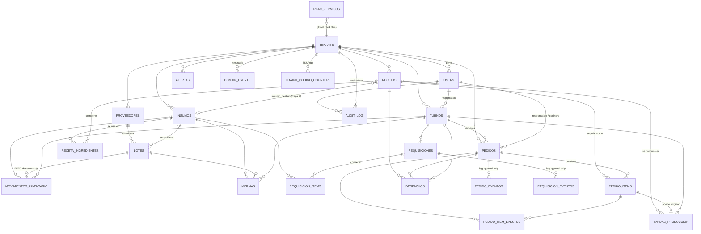

# 11 · Base de datos

> Todo lo de este documento se obtuvo **introspeccionando una base real**: se aplicaron las
> 80 migraciones del repositorio sobre un PostgreSQL 16 limpio con
> `scripts/sql-harness/apply.sh` y se consultaron los catálogos del sistema.
> **Las 80 migraciones aplican sin un solo error.**

## 1. Inventario global

| Objeto                     | Cantidad medida   |
| -------------------------- | ----------------- |
| Tablas                     | **25**            |
| Vistas                     | 1                 |
| Vistas materializadas      | 1                 |
| Tipos ENUM                 | 15                |
| Funciones propias          | 33                |
| Triggers (no internos)     | 25                |
| Políticas RLS              | 48 (en 22 tablas) |
| Índices                    | 109               |
| Claves foráneas            | 67                |
| Constraints UNIQUE + CHECK | 41                |

## 2. ERD



## 3. Tablas — propósito y notas

| Tabla                      | Propósito                                                     | RLS |            Políticas             | Notas relevantes                                                |
| -------------------------- | ------------------------------------------------------------- | :-: | :------------------------------: | --------------------------------------------------------------- |
| `tenants`                  | Salas / clientes del SaaS                                     | ✅  |            1 (SELECT)            | `slug` UNIQUE; soft delete                                      |
| `users`                    | Perfil por usuario; FK a `auth.users` con `ON DELETE CASCADE` | ✅  |                3                 | El rol vive aquí **y** en el JWT; `assertCan` compara ambos     |
| `insumos`                  | Catálogo de materia prima y elaborados                        | ✅  |                3                 | `merma_default numeric(5,4)`; `capa`; UNIQUE `(tenant, codigo)` |
| `lotes`                    | Recepciones con vencimiento, coste y proveedor                | ✅  |                3                 | `costo_unitario numeric(14,4)`; base de FEFO                    |
| `recetas`                  | Recetas de producción y de servicio                           | ✅  |                3                 | 3 CHECK que hacen cumplir el modelo (§5)                        |
| `receta_ingredientes`      | Composición                                                   | ✅  |                3                 | UNIQUE por receta+insumo; `merma_coeficiente` es histórico      |
| `tandas_produccion`        | Producción por tandas capa 1 → capa 2                         | ✅  |                3                 | `idempotency_key` UNIQUE; `zona_destino`; `pedido_item_id`      |
| `despachos`                | Despachos a zona                                              | ✅  |                3                 | `idempotency_key` UNIQUE                                        |
| `movimientos_inventario`   | **Ledger de inventario**                                      | ✅  |         1 (solo SELECT)          | Escritura solo por RPC `SECURITY DEFINER`; `turno_id` (F-004)   |
| `mermas`                   | Registro de mermas                                            | ✅  |      2 (sin UPDATE/DELETE)       | Efectivamente append-only                                       |
| `pedidos`                  | Cabecera de pedido                                            | ✅  |         1 (solo SELECT)          | `version` para locking; `origen`; `prioridad`                   |
| `pedido_items`             | Ítems con estado propio                                       | ✅  |         1 (solo SELECT)          | `area_produccion`, `estado`, timestamps y actores               |
| `pedido_eventos`           | Log append-only del pedido                                    | ✅  |         1 (solo SELECT)          |                                                                 |
| `pedido_item_eventos`      | Log append-only por ítem                                      | ✅  |         1 (solo SELECT)          |                                                                 |
| `turnos`                   | Sesión de trabajo                                             | ✅  |                3                 | `teamlider NOT NULL`; `bloque`; `cierre_motivo`                 |
| `proveedores`              | Proveedores                                                   | ✅  |                3                 | Soft delete                                                     |
| `alertas`                  | Alertas in-app                                                | ✅  |                3                 | 4 CHECK sobre tipo/severidad/recurso                            |
| `requisiciones`            | Requisición cocina → almacén                                  | ✅  |                3                 | `version`; `idempotency_key NOT NULL`; 5 timestamps de estado   |
| `requisicion_items`        | Ítems solicitados y despachados                               | ✅  |                3                 |                                                                 |
| `requisicion_eventos`      | Log append-only                                               | ✅  |                2                 | Triggers bloquean UPDATE/DELETE                                 |
| `domain_events`            | Eventos de dominio                                            | ✅  |            1 (SELECT)            | **Inmutable** por triggers                                      |
| `audit_log`                | Auditoría con **hash chain SHA-256**                          | ✅  | 1 (SELECT, solo admin/superuser) | **Inmutable**; `audit_log_set_hash` en BEFORE INSERT            |
| `operaciones_idempotentes` | Registro de operaciones idempotentes                          | ✅  |              **0**               | Inaccesible salvo por `SECURITY DEFINER`                        |
| `tenant_codigo_counters`   | Contadores de SKU y lote por tenant                           | ✅  |              **0**               | Idem                                                            |
| `rbac_permisos`            | Matriz generada — **144 filas**                               | ✅  |              **0**               | Idem. La consulta `fn_puede()`                                  |

## 4. Convenciones — cumplimiento verificado

| Convención de `CLAUDE.md`                | ¿Se cumple?                                                                                                                        |
| ---------------------------------------- | ---------------------------------------------------------------------------------------------------------------------------------- |
| IDs `uuid` con `gen_random_uuid()`       | ✅ en las 25 tablas                                                                                                                |
| `tenant_id uuid NOT NULL` + RLS en todas | ✅ salvo `operaciones_idempotentes` (clave textual, sin tenant, por diseño)                                                        |
| Soft delete `deleted_at`                 | ✅ en tenants, users, insumos, lotes, recetas, pedidos, proveedores, requisiciones, turnos                                         |
| `audit_log` y `domain_events` inmutables | ✅ triggers `prevent_mutation` en UPDATE y DELETE                                                                                  |
| Monetario `numeric(14,2)` COP            | ⚠️ `lotes.costo_unitario` es `numeric(14,4)` — **correcto**: es coste unitario, y `CLAUDE.md` lo especifica así en su propia lista |
| Cantidades `numeric(12,4)`               | ✅                                                                                                                                 |
| Timestamps `timestamptz`                 | ✅ sin excepción                                                                                                                   |
| Migraciones idempotentes                 | ✅ verificado: aplican sobre base limpia sin error                                                                                 |

## 5. Constraints que hacen cumplir el negocio

Los mejores ejemplos del repositorio de reglas de negocio **en la base**, no en la app:

```sql
recetas_produccion_tiene_destino      -- receta de producción ⇒ insumo_destino_id NOT NULL
recetas_produccion_tiene_rendimiento  -- receta de producción ⇒ rendimiento_cantidad NOT NULL
recetas_servicio_tiene_zona           -- receta de servicio  ⇒ zona NOT NULL
chk_turnos_bloque_required            -- turno debe declarar bloque
chk_turnos_cierre_motivo              -- cierre debe declarar motivo
chk_requisicion_area_solicitante      -- área ∈ {cocina_caliente, cocina_fria, amex, pasteleria}
insumos_merma_default_check           -- 0 ≤ merma < 1
```

Más `UNIQUE` sobre `idempotency_key` en `despachos`, `mermas`, `movimientos_inventario` y
`tandas_produccion`, y un índice único **por tenant** en `pedidos`
(`idx_pedidos_idempotency_tenant`) — corrección de la colisión cross-tenant que traía el
UNIQUE global.

## 6. Funciones — las 33 propias

**Núcleo transaccional (`SECURITY DEFINER`, todas con `search_path=public`):**

| Función                                | Qué garantiza                                                     |
| -------------------------------------- | ----------------------------------------------------------------- |
| `fn_descontar_insumo_fefo`             | Descuento atómico FEFO con `FOR UPDATE` e idempotencia            |
| `fn_entregar_pedido`                   | FEFO + transición a `entregado` en una transacción                |
| `fn_transicionar_item`                 | Estado de ítem + estado agregado del pedido, bloqueando el pedido |
| `fn_crear_pedido` / `_qr`              | Alta atómica de pedido + ítems                                    |
| `fn_pedido_transicion`                 | Transiciones sin movimiento de inventario                         |
| `fn_pedido_asignar_cocinero`           | Asignación con locking                                            |
| `fn_completar_tanda`                   | Materializa la capa 2 al completar (F-037)                        |
| `fn_registrar_merma`                   | Merma atómica (F-022)                                             |
| `fn_costo_receta` / `fn_costo_recetas` | Coste en tiempo real; la versión en lote cerró el N+1 (F-021)     |
| `fn_siguiente_codigo_insumo` / `_lote` | Contadores por tenant                                             |
| `fn_provisionar_claims_usuario`        | Provisión de claims; cierra F-001                                 |
| `fn_puede`                             | Consulta la matriz RBAC                                           |
| `handle_new_user`                      | Trigger de alta, endurecido (`20260822000001`)                    |
| `cerrar_turnos_expirados`              | Autocierre, por `pg_cron` cada 15 min                             |
| `refresh_analytics_views`              | Refresco de vistas materializadas                                 |
| `audit_log_set_hash`                   | Hash chain SHA-256                                                |

**Helpers de JWT (`INVOKER`):** `fn_jwt_role`, `fn_jwt_tenant`, `fn_jwt_user`,
`fn_puede_en_tenant`, `fn_permiso_transicion_pedido`, `fn_zona_permitida_para_rol`.

**Triggers de validación:** `fn_validate_*_tenant` (5 funciones) impiden que una fila hija
apunte a un padre de otro tenant. `validate_pedido_estado` y `validate_tanda_estado` hacen
cumplir las máquinas de estado en base.

Las 16 funciones `SECURITY DEFINER` llevan `search_path` fijado — cierre del endurecimiento
`20260516000001_security_hardening_search_path.sql`. Ninguna quedó sin él.

## 7. Índices — 109

**Verificado:** todas las claves foráneas tienen índice (migración
`20260516000002_fk_indexes_and_on_delete.sql`).

**20 índices parciales** para las consultas calientes, entre ellos:

```
idx_lotes_fefo               -- la cola FEFO
idx_pedidos_activos          -- pedidos no borrados
idx_requisiciones_cola_almacen -- la cola del almacenero
idx_alertas_no_leidas        -- la campana
idx_pedido_items_area        -- el filtro de cada KDS
idx_recetas_categoria_menu   -- la carta QR
```

Es un trabajo de indexado deliberado, no accidental.

## 8. Vistas materializadas

Solo queda **una**: `mv_consumo_vs_produccion_turno`, con dimensiones `turno` × `insumo` y
métricas `total_entradas`, `total_consumo`, `total_merma`, `total_ajustes`.

Se consume a través de `v_consumo_vs_produccion_turno_tenant`, que filtra por el tenant del
JWT. **Y ahí está el defecto crítico H-A**, detallado en
[`20-technical-debt.md`](./20-technical-debt.md) y demostrado ejecutando SQL en
[`23-evidence-index.md`](./23-evidence-index.md).

## 9. Trabajos programados (`pg_cron`)

Verificado consultando `cron.job` en la base reconstruida:

| Job                       | Cadencia       | Qué hace                                    |
| ------------------------- | -------------- | ------------------------------------------- |
| `check-alertas`           | `*/5 * * * *`  | `net.http_post` a `/api/cron/check-alertas` |
| `cerrar-turnos-expirados` | `*/15 * * * *` | Cierra turnos cuyo bloque ya terminó        |

**No hay ningún job que refresque `mv_consumo_vs_produccion_turno`** — hallazgo H-D.

## 10. Problemas de diseño detectados

| #   | Problema                                                                                                                                                        | Severidad                                          |
| --- | --------------------------------------------------------------------------------------------------------------------------------------------------------------- | -------------------------------------------------- |
| 1   | `v_consumo_vs_produccion_turno_tenant` con `security_invoker=true` sobre una MV cuyo `SELECT` está revocado a `authenticated`                                   | 🔴 Crítico                                         |
| 2   | `refresh_analytics_views` itera sobre `mv_cogs_per_passenger`, eliminada                                                                                        | 🟡 Cosmético (hay guarda)                          |
| 3   | ENUM `tipo_acceso_sala` sin ninguna tabla que lo use (resto de vuelos/afluencia)                                                                                | 🟡 Limpieza                                        |
| 4   | ENUM `unidad_medida` conserva `kg`, `l`, `lb`, `porcion` inertes tras el paso a g/ml/unidad                                                                     | ⚪ Inevitable (Postgres no permite quitar valores) |
| 5   | ENUM `user_role` conserva `chef` y `recepcion` inertes                                                                                                          | ⚪ Idem                                            |
| 6   | ENUM `area_produccion` conserva `cocina` legacy                                                                                                                 | ⚪ Idem                                            |
| 7   | `alertas_update_permiso` usa `alertas:read` para UPDATE: quien pueda leer puede editar el texto y la severidad de una alerta, no solo marcarla leída            | 🟡 Bajo                                            |
| 8   | `audit_log` y `domain_events` mantienen grants de INSERT/UPDATE/DELETE a `anon`/`authenticated`; los triggers los bloquean, pero la defensa es de una sola capa | 🟡 Bajo                                            |
| 9   | `lotes.proveedor` (texto libre) coexiste con `lotes.proveedor_id` (FK)                                                                                          | 🟡 Deuda de migración                              |

## 11. Semillas y catálogo

`20260530000003_catalogo_real_dorado.sql` (10 KB) siembra el catálogo real de la sala.
`scripts/seed-recetario-amex.mjs` + `scripts/data/recetario-amex.mjs` +
`scripts/lib/validar-recetario.mjs` cargan y validan el recetario AMEX, con prueba propia
(`scripts/tests/recetario.test.mjs`). `scripts/reset-test-users.mjs` reconcilia de forma
idempotente el conjunto canónico de usuarios de prueba.
